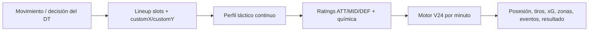

# Match Engine Influence Contract

Fecha: 2026-07-12

Este documento define qué cosas deben afectar el partido para que el juego se sienta profesional. La regla base es:

> Toda decisión del DT debe viajar hasta el motor: jugador, rol, píxel, química, táctica y contexto.

## Cadena obligatoria

## Factores que deben afectar el partido

| Factor | Entrada técnica | Debe afectar |
|---|---|---|
| Formación seleccionada | `formation` | Base ATT/MID/DEF, volumen, zonas, riesgo |
| Jugador elegido | atributos + skills + estado | Calidad de tiros, marca, pase, stamina, eventos |
| Rol natural vs rol táctico | `naturalPosition` vs `position` | Efectividad individual |
| Posición manual por píxel | `customXPercent/customYPercent` | Efectividad, shape, canales, xG, posesión |
| Altura del jugador | `customYPercent` | Ataque/defensa/medio, presión, riesgo |
| Ancho del jugador | `customXPercent` | Bandas/centro, cobertura lateral |
| Distancia entre compañeros | tactical chemistry links | Química, circulación, vulnerabilidad |
| Táctica de equipo | `TeamStyle` | Probabilidad de chance, zonas, posesión |
| Cambios durante partido | style/formation/substitution events | Desde minuto efectivo en adelante |
| Fatiga/lesión/tarjetas | player state | Rendimiento, disponibilidad, riesgo |
| Rival | perfil rival | Duelos de canales, resistencia defensiva |
| Resultado/minuto | match context | Riesgo, urgencia, sustituciones |

## Estado actual del motor

| Capa | Estado | Observación |
|---|---|---|
| Persistencia de slots con píxeles | Parcial/OK | `LineupSlotDTO` soporta `customXPercent/customYPercent`. |
| Preview de ratings | OK | `FormationEffectiveness` y `TeamRatingsCalculator` usan coordenadas. |
| Química táctica | OK inicial | `TacticalChemistryCalculator` usa distancia y canales. |
| Posesión y volumen de chances | OK inicial | `V24DetailedMatchEngine` usa `V24TacticalShapeProfile`. |
| Zonas de tiro | OK inicial | `selectShotLocation` usa shape/canales. |
| xG por calidad ATT/DEF | Mejorado en V25D99.22 | Ahora `aggregateAttackerStat` y `aggregateDefenderStat` usan coordenadas continuas vía `SubdivisionEffectivenessCalculator`. |
| Sustituciones | Parcial | Cambian jugador/atributos, pero falta medir impacto promedio. |
| Cambios en vivo de formación | Parcial | Cambian etiqueta/roles; falta asegurar slots/coords live para cambios manuales. |

## V25D99.22 implementado

Problema detectado:

- El motor ya leía `customX/customY` para shape/canales.
- Pero `aggregateAttackerStat` y `aggregateDefenderStat`, que alimentan el xG base, seguían usando sólo `PositionEffectivenessCalculator`.
- Eso hacía que algunos movimientos pequeños afectaran zonas/posesión pero no la calidad ofensiva/defensiva del jugador.

Cambio:

- `V24DetailedMatchEngine.aggregateAttackerStat(...)` ahora recibe `slotsByPlayerId`.
- `V24DetailedMatchEngine.aggregateDefenderStat(...)` ahora recibe `slotsByPlayerId`.
- Ambos usan `SubdivisionEffectivenessCalculator.effectiveness(naturalPosition, x, y, tacticalPosition)`.
- Si no hay slot/píxeles, cae al comportamiento anterior por compatibilidad.

Resultado esperado:

- Mover un jugador 1px puede cambiar mínimamente su efectividad.
- Moverlo mucho cambia más.
- Cruzar de zona sigue teniendo impacto mayor.
- El xG debe responder mejor a posiciones manuales.

## V25D99.22.1 implementado

Problema detectado:

- Si un mediocampista se movía visualmente hacia arriba, el motor podía leer sólo la penalización por alejarse de su punto ideal.
- Eso hacía que una decisión lógica de DT —convertir un 4-4-2 en algo más parecido a 4-3-3/4-2-3-1— pareciera “peor en todo”.

Cambio:

- `V24DetailedMatchEngine.aggregateAttackerStat(...)` ahora también aplica un `forwardIntentMultiplier` cuando existe `customYPercent` real.
- El bonus es suave y sólo para no-delanteros:
  - `y=60`: sin bonus.
  - `y=40`: bonus ofensivo moderado.
  - `y` cerca del área rival: bonus máximo acotado.
- No se aplica con coordenadas inferidas/fallback, para preservar saves/tests viejos.

Contrato verificado:

| Prueba | Resultado |
|---|---|
| `mvn -q -Dtest=V24DetailedMatchEngineFormationTest test` | OK |
| MID con misma etiqueta táctica movido de `y=60` a `y=40` | sube el input ofensivo del motor |
| Lineup sin coordenadas custom | conserva el comportamiento legacy |
| `mvn -q -DskipTests package` | OK |

## V25D99.22.2 implementado

Problema detectado:

- El preview ya trataba la formación manual como una forma progresiva.
- El motor todavía usaba cortes duros por altura (`ATT/MID/DEF`) dentro de `tacticalShapeProfile`.
- Eso podía generar saltos raros: mover un jugador cerca de una frontera visual podía cambiar mucho más de lo que corresponde.

Cambio:

- `V24DetailedMatchEngine.tacticalShapeProfile(...)` ahora calcula DEF/MID/ATT como pesos suaves según `customYPercent`.
- Usa la misma lógica conceptual que `TeamRatingsCalculator.softShapeFromCoords(...)`:
  - más arriba → más peso ATT;
  - zona media → más peso MID;
  - más abajo → más peso DEF;
  - entre zonas → reparto parcial, sin frontera brusca.

Contrato verificado:

| Prueba | Resultado |
|---|---|
| MID movido de `y=60` a `y=40` | sube `attackVolumeMultiplier` |
| MID movido de `y=40` a `y=39` | cambio pequeño, sin salto brusco |
| `mvn -q -Dtest=V24DetailedMatchEngineFormationTest test` | OK |

## Reglas de diseño para píxeles

| Movimiento | Debe cambiar suavemente |
|---|---|
| +1px hacia arriba | +ataque muy leve, -defensa/cobertura muy leve |
| +10px hacia arriba | cambio visible pero no salto brusco |
| MID cerca de ATT | más aporte ofensivo, menor estabilidad media |
| DEF muy alto | presión/posesión mejor, más riesgo atrás |
| Winger cerrado al centro | menos banda, más centro |
| Equipo muy estrecho | más centro, vulnerable por bandas |
| Equipo muy ancho | más banda, menos conexión central |

## Contrato profesional de consistencia visual

Estas reglas son el norte para que el juego se sienta de DT real, no de números arbitrarios.

| Lo que ve el DT | Preview debe mostrar | Motor debe hacer |
|---|---|---|
| Un jugador sube unos píxeles | Ataque sube apenas o medio baja apenas | Más intención ofensiva, sin alterar el resultado de golpe |
| Un jugador sube mucho | Ataque sube más, defensa/medio pueden resentirse | Más volumen/xG potencial, más riesgo defensivo |
| Un defensor se mete en ataque | Puede subir ataque pero con penalización de rol | Aporta menos que un atacante natural y deja peor cobertura |
| Un mediocampista queda como enganche | Ataque sube, medio puede bajar poco | Más soporte ofensivo y más peso central |
| Todos se cierran al centro | Centro mejora, bandas bajan | Más ataques centrales, más vulnerabilidad por fuera |
| Todos se abren a bandas | Bandas mejoran, conexión central baja | Más wide shots/crosses, menos juego interior |
| 4-4-2 manual parece 4-3-3 | Ratings se acercan gradualmente a 4-3-3 | Shape/volumen/canales se acercan gradualmente, no por salto |
| Cambio de jugador por otro mejor | Ratings/chem cambian por atributos y rol | xG/defensa/eventos cambian desde el minuto efectivo |
| Cambio de jugador fuera de rol | Puede empeorar aunque tenga OVR alto | Penalización por naturalPosition vs ubicación real |
| Movimiento mínimo de 1px | Cambio minúsculo o invisible en números redondeados | Cambio interno continuo, no cliff visible |

Regla base: el número puede redondearse igual en la UI, pero la métrica interna debe ser continua. Si el jugador cruza una zona, el cambio puede ser mayor, pero debe sentirse como transición, no como teletransporte táctico.

## Próximos tests obligatorios

1. Mismo partido + mismo seed + mover un jugador 1px:
   - debe cambiar al menos una métrica continua interna o preview;
   - no necesariamente el resultado.
2. Mismo partido + mismo seed + mover un jugador 15px:
   - debe cambiar ratings y alguna métrica de partido.
3. WIDE_PLAY:
   - debe subir wide shots promedio en N seeds.
4. CENTRAL_PLAY:
   - debe subir central shots promedio en N seeds.
5. Sustitución por jugador mejor:
   - debe mejorar xG/tiros/rating promedio desde el minuto del cambio.
6. Sustitución fuera de rol:
   - debe poder empeorar aunque el OVR sea alto.

## V25D99.22.4 - Baseline correcto para calibrar cambios durante el partido

Regla nueva del harness:

- Para medir cambios al minuto 45, comparar contra `m45-noop-replay`.
- No comparar contra `base-balanced`, porque ese escenario simula el partido completo desde minuto 0.
- Para sustituciones al minuto 60, comparar contra `m60-noop-replay`.

Contrato verificado el 2026-07-12 con seeds `12345..12364`:

| Cambio | Resultado esperado | Resultado observado |
|---|---|---|
| `CENTRAL_PLAY` desde minuto 45 | mas ataques centrales, menos banda | `+3.75` central, `-2.55` wide promedio |
| `WIDE_PLAY` desde minuto 45 | mas ataques por banda, menos centro | `-2.30` central, `+3.75` wide promedio |
| mover MID de `y40` a `y39` | diferencia minima, no cliff | xG promedio `+0.011` -> `+0.023` vs noop |
| mover MID a banda `x18/y50` | mas ancho, sin boost gratis | wide `+0.70`, xG `-0.020` promedio |
| cambiar a `4-2-3-1` | cambio leve y coherente | xG `+0.060`, central `+1.25`, wide `-1.15` |

Interpretacion profesional:

- Un pixel debe afectar probabilidades internas, no garantizar un evento distinto en una seed.
- Los cambios tacticos se validan por tendencia multi-seed.
- Si una sola seed cambia radicalmente, revisar el promedio antes de tocar coeficientes.
- Si el promedio muestra un salto grande por un movimiento minimo, bajar multiplicadores o suavizar pesos.

## V25D99.22.5 - Contrato para sustituciones

Regla nueva:

- Toda sustitucion debe medirse contra un replay sin cambio del mismo minuto.
- El harness debe distinguir sustitucion positiva, negativa y neutral.
- El nombre `impact-sub` no implica mejora; solo implica que el cambio deberia tener impacto medible.

Contrato verificado el 2026-07-12 con seeds `12345..12364`:

| Cambio | Baseline | Resultado observado |
|---|---|---|
| `m60-impact-sub` | `m60-noop-replay` | xG usuario `-0.095`, tiros usuario `-3.00`, xG rival `+0.011` |

Interpretacion:

- Las sustituciones ya llegan al motor y afectan el partido.
- En la muestra, `Kylian Mbappe (ATT) -> Jude Bellingham (ATT)` empeora el ataque promedio.
- El siguiente nivel profesional es mostrar por que: atributos, rol natural, encaje en slot, stamina y quimica.
- Una sustitucion con `scoreDelta > 0` deberia tender a mejorar metricas relevantes; una con `scoreDelta < 0` deberia tender a empeorarlas. Si no ocurre en promedio multi-seed, hay que revisar motor o scoring del harness.

## V25D99.22.6 - Contrato upgrade/downgrade de sustituciones

Regla nueva:

- `m60-upgrade-sub` debe elegir el mejor par titular/banco por misma posicion con `scoreDelta > 0`.
- `m60-downgrade-sub` debe elegir el peor par titular/banco por misma posicion con `scoreDelta < 0`.
- El impacto esperado depende del rol:
  - upgrade ofensivo: deberia subir xG/tiros propios;
  - upgrade defensivo: deberia bajar xG/tiros rivales;
  - downgrade ofensivo: deberia bajar xG/tiros propios y/o subir control rival;
  - downgrade defensivo: deberia subir peligro rival.

Contrato verificado el 2026-07-12 con seeds `12345..12364`:

| Scenario | Cambio | Resultado observado |
|---|---|---|
| `m60-downgrade-sub` | Mbappe -> Endrick `[-40]` | xG usuario `-0.129`, tiros usuario `-3.30`, xG rival `+0.028` |
| `m60-impact-sub` | Mbappe -> Bellingham `[+0]` | xG usuario `-0.095`, tiros usuario `-3.00`, xG rival `+0.011` |
| `m60-upgrade-sub` | Raul Asencio -> Ferland Mendy `[+36]` | xG usuario `+0.003`, xG rival `-0.007` |

Interpretacion:

- El motor ya distingue cambios buenos/malos de forma medible.
- En esta muestra, el upgrade disponible es defensivo; por eso su efecto correcto es mas pequeno y aparece en menor xG rival, no en ataque propio.
- Todavia falta un caso controlado de upgrade ofensivo real para cerrar el contrato completo.

## V25D99.22.7 - Contrato por intencion de sustitucion

Regla nueva:

- Las sustituciones deben clasificarse por intencion futbolistica:
  - ofensiva: `ATT` / `WINGER`;
  - defensiva: `DEF`.
- Cada tipo se evalua con metricas distintas:
  - upgrade ofensivo: xG/tiros propios;
  - downgrade ofensivo: xG/tiros propios a la baja;
  - upgrade defensivo: xG/tiros rivales a la baja;
  - downgrade defensivo: xG/tiros rivales al alza.
- Si no existe un caso real en el plantel, el harness no debe mostrar una fila falsa.

Contrato verificado el 2026-07-12 con seeds `12345..12364`:

| Scenario | Cambio | Resultado observado |
|---|---|---|
| `m60-offensive-downgrade-sub` | Mbappe -> Endrick `[-40]` | xG usuario `-0.129`, tiros usuario `-3.30`, xG rival `+0.028` |
| `m60-defensive-upgrade-sub` | Raul Asencio -> Ferland Mendy `[+36]` | xG usuario `+0.003`, xG rival `-0.007` |
| `m60-defensive-downgrade-sub` | Dani Carvajal -> Fran Garcia `[-16]` | xG usuario `-0.001`, xG rival `+0.002` |

Lectura:

- El downgrade ofensivo esta bien capturado.
- El upgrade defensivo tiene efecto correcto pero chico.
- El downgrade defensivo es demasiado sutil en este caso; puede ser razonable si la diferencia real es pequena, pero hay que probar un caso mas extremo.
- Falta fixture controlado con upgrade ofensivo real.

## V25D99.22.8 - Contrato cerrado para upgrade ofensivo

Se preparo un fixture controlado con `inject-player-stats`:

- Mbappe bajo a perfil ofensivo 65.
- Endrick subio a perfil ofensivo 99.

Contrato verificado el 2026-07-12 con seeds `12345..12364`:

| Scenario | Cambio | Resultado observado |
|---|---|---|
| `m60-offensive-upgrade-sub` | Mbappe -> Endrick `[+136]` | xG usuario `+0.151`, tiros usuario `+2.25`, tiros rival `-0.50` |

Interpretacion:

- Un upgrade ofensivo real desde el banco mejora el ataque promedio.
- Esto valida que cambios de jugador, atributos y minuto efectivo ya viajan hasta el motor.
- El resultado de una seed individual puede variar; la regla profesional se evalua por promedio multi-seed.
- Este laboratorio modifica el career smoke; para pruebas limpias conviene automatizar preparacion/restauracion.

## V25D99.22.9 - Harness productivo para calibracion

Contrato de herramienta:

- `Prepare offensive lab` debe crear un caso fuerte de upgrade ofensivo real.
- `Restore lab` debe devolver el career smoke a valores base.
- La matriz debe medirse contra `m60-noop-replay`.
- Una seed individual sirve para smoke visual; el balance se decide con promedio multi-seed.

Estado:

| Contrato | Estado |
|---|---|
| cambio de jugador ofensivo bueno sube ataque | Validado |
| cambio de jugador ofensivo malo baja ataque | Validado |
| cambio defensivo bueno reduce peligro rival | Validado leve |
| cambio defensivo malo aumenta peligro rival | Pendiente de lab extremo |

Proximos ajustes de motor:

1. Crear `Prepare defensive downgrade lab` para probar un DEF titular fuerte por un DEF suplente muy debil.
2. Si el promedio sigue casi plano, revisar sensibilidad defensiva:
   - `aggregateDefenderStat`;
   - duelos de canal rival;
   - riesgo por bandas/centro;
   - impacto de defensores sustituidos desde minuto efectivo.
3. Agregar `Professional multi-seed matrix` en UI para ver promedio, min, max y tendencia por escenario.

## V25D99.22.10 - Contrato defensivo extremo

Se agrego un laboratorio defensivo:

- `Prepare defensive lab`: Carvajal fuerte, Fran Garcia muy debil.
- `Restore defensive lab`: vuelve a valores smoke.

Contrato verificado el 2026-07-12 con seeds `12345..12364`:

| Scenario | Cambio | Resultado observado |
|---|---|---|
| `m60-defensive-downgrade-sub` | Carvajal -> Fran Garcia `[-193]` | xG rival `+0.056`, tiros rivales `+0.00` |

Interpretacion:

- El downgrade defensivo extremo ya afecta el peligro rival.
- El motor aumenta calidad de chances rivales, pero no volumen.
- Ajuste candidato: que defensores muy inferiores tambien aumenten frecuencia de ataques/tiros rivales por canal, especialmente desde el minuto efectivo.

## V25D99.22.11 - Defensa tambien afecta volumen

Cambio aplicado:

- `aggregateDefenderStat` sigue afectando calidad/xG del tiro.
- Nuevo `defenderRosterChanceVolumeMultiplier` afecta chance volume de forma conservadora.
- Rango: `0.94` a `1.12`.

Contrato verificado con lab defensivo extremo (`12345..12364`):

| Metric | Antes | Despues |
|---|---:|---:|
| xG rival | +0.056 | +0.070 |
| tiros rivales | +0.00 | +0.35 |

Interpretacion:

- Un defensor muy inferior ahora genera mas peligro rival por dos vias: calidad y volumen.
- El ajuste es chico para evitar arcade/ruptura de balance.
- Siguiente paso profesional: aplicar parte del volumen por canal, segun donde se ubica el DEF debil y por donde ataca el rival.

## V25D99.22.12 - Contrato de medicion multi-seed

Nuevo contrato:

- Una seed individual es solo smoke visual.
- Un ajuste de motor se considera valido cuando mantiene tendencia en promedio multi-seed.
- La UI debe permitir medir esto sin PowerShell.

Herramienta agregada:

- Backend: `POST /api/v1/test-harness/career/match/{matchId}/scenario-matrix/summary`.
- Frontend: `debug/test-harness` -> `Multi-seed matrix`.

Defaults:

- `seedStart`: seed actual del Panel B o `12345`.
- `seedCount`: `20`.

Reglas de baseline:

| Tipo de escenario | Baseline |
|---|---|
| sin cambio / base | `base-balanced` |
| cambios minuto 45 | `m45-noop-replay` |
| cambios minuto 60 | `m60-noop-replay` |

Campos obligatorios para calibrar:

| Campo | Debe responder a |
|---|---|
| `avgUserXgDelta` | formacion, estilo, posicion, sustitucion ofensiva |
| `avgOpponentXgDelta` | forma defensiva, sustitucion defensiva, exposicion por canal |
| `avgUserShotsDelta` / `avgOpponentShotsDelta` | volumen, no solo calidad |
| `avgUserCentralDelta` / `avgUserWideDelta` | centro vs bandas |
| `minUserXgDelta` / `maxUserXgDelta` | ruido esperado de simulacion |

Smoke verificado:

- Match usuario: `4a9c6711-72ac-4901-a672-b5790857787e`.
- Seeds `12345..12349` y default UI `12345..12364`.
- Resultado: `13` escenarios.
- Runtime default local `n=20`: `21.52s`.

Lectura default UI `n=20`:

| Scenario | Resultado |
|---|---|
| `m45-wide` | `+3.55` tiros wide, `-1.25` central |
| `m45-central` | `+3.65` tiros central, `-1.65` wide |
| `m45-position-mid-up-1px` | `+0.051` xG usuario; efecto chico, visible |
| `m60-upgrade-sub` | casi plano en plantel base; requiere lab para evaluar sustituciones fuertes |

Criterio profesional:

- Si un cambio visual mueve un jugador hacia banda, debe verse en `avgUserWideDelta` o en peligro concedido por el canal opuesto.
- Si un cambio es de solo `1px`, puede tener efecto chico, pero no deberia producir saltos radicales sin cruzar una zona tactica real.
- Si una sustitucion mejora/empeora atributos, debe verse desde el minuto efectivo en promedio, aunque una seed individual pueda salir al reves.

## V25D99.22.13 - Contrato de labs confirmado en UI/API

Medicion multi-seed `n=20`, partido `4a9c6711-72ac-4901-a672-b5790857787e`.

| Lab | Scenario | Contrato | Resultado |
|---|---|---|---|
| ofensivo | `m60-offensive-upgrade-sub` | upgrade ofensivo debe subir ataque | xG usuario `+0.167`, tiros `+2.95` |
| defensivo | `m60-defensive-downgrade-sub` | downgrade defensivo debe subir peligro rival | xG rival `+0.070`, tiros rival `+0.35` |
| defensivo | `m60-offensive-downgrade-sub` | downgrade ofensivo debe bajar ataque propio | xG usuario `-0.125`, tiros `-2.45` |

Lectura:

- El motor cumple el contrato en casos controlados.
- Si en el plantel base una sustitucion se ve plana, puede ser correcto si los jugadores son parecidos.
- Para hacerlo mas profesional, el impacto visible debe expresarse por rol/canal/minuto, no con un multiplicador global exagerado.

## V25D99.22.14 - Contrato de defensa por canal

Nuevo contrato:

- La calidad defensiva usada para xG no debe ser solo global.
- Tiros por banda deben leer mas al lateral/carrilero de ese canal.
- Tiros centrales deben leer mas a centrales/GK.
- Debe conservarse una mezcla global para evitar discontinuidades.

Implementacion:

- `aggregateDefenderStatForLocation(...)`
- Mezcla: `70%` defensa del canal + `30%` defensa global.
- Ubicacion:
  - `PENALTY_AREA_WIDE`: mayor peso a defensores con `x < 35` o `x > 65`.
  - `PENALTY_AREA_CENTER` / `SIX_YARD_BOX`: mayor peso a defensores centrales.

Test:

- `channelSensitiveDefenderStatMakesWeakWideDefenderHurtWideShotsMore`

Criterio profesional:

- Un lateral malo no debe bajar toda la defensa por igual.
- Debe hacer mas peligroso atacar por su banda.
- Para verlo en UI falta un escenario de harness que fuerce ataque por esa banda y reporte xG/tiros por canal del rival.

## V25D99.22.15 - Contrato visible en harness: rival por centro/bandas

La matriz multi-seed ahora debe mostrar exposicion del usuario tambien desde el punto de vista rival.

Campos nuevos:

- `avgOpponentCentralDelta`
- `avgOpponentWideDelta`

Escenarios nuevos:

| Scenario | Accion | Debe mostrar |
|---|---|---|
| `m45-opponent-wide` | Rival cambia a `WIDE_PLAY` | suba `avgOpponentWideDelta` |
| `m45-opponent-central` | Rival cambia a `CENTRAL_PLAY` | suba `avgOpponentCentralDelta` |

Smoke `n=20`:

| Scenario | xG rival | Tiros rival | Zonas rival |
|---|---:|---:|---|
| `m45-opponent-wide` | `+0.021` | `+0.65` | C `-0.70`, W `+1.65` |
| `m45-opponent-central` | `+0.072` | `+0.65` | C `+2.55`, W `-1.05` |

Interpretacion profesional:

- Ya no alcanza mirar solo puntaje general.
- El harness debe responder: "si muevo mis jugadores, por donde me lastima el rival?".
- Esta medicion es la base para calibrar laterales, carrileros, centrales y sobrecargas.

## V25D99.22.16 - Contrato de lab wide DEF

Nuevo lab:

- `Prepare weak wide DEF lab`
- `Restore weak wide DEF lab`

Contrato:

- Si defensores ubicados en banda se vuelven muy debiles, `m45-opponent-wide` debe aumentar la calidad del peligro rival por banda.
- No es obligatorio que suba el volumen de tiros: volumen y calidad son capas distintas.

Smoke:

| Estado | Scenario | xG rival |
|---|---|---:|
| baseline | `m45-opponent-wide` | `+0.021` |
| weak-wide-def-lab | `m45-opponent-wide` | `+0.049` |

Interpretacion:

- La defensa por canal ya afecta xG.
- Para hacerlo todavia mas visible en UI, una futura version puede separar xG rival central/wide, no solo tiros central/wide.
- Restore del lab debe preservar otros slots del equipo y remover solo slots forzados por el lab.

## V25D99.22.17 - Contrato de xG por zona

Nuevo contrato:

- El harness debe separar volumen de peligro.
- Tiros por banda/centro no alcanzan; hay que ver xG por banda/centro.

Campos:

- `avgOpponentCentralXgDelta`
- `avgOpponentWideXgDelta`
- `avgUserCentralXgDelta`
- `avgUserWideXgDelta`

Smoke con weak wide DEF lab (`n=5`):

| Scenario | xG rival C | xG rival W |
|---|---:|---:|
| `m45-opponent-wide` | `-0.053` | `+0.098` |
| `m45-opponent-central` | `+0.114` | `-0.039` |

Interpretacion profesional:

- `opponent-wide` debe subir xG wide rival cuando la banda esta vulnerable.
- `opponent-central` debe subir xG central rival cuando el rival juega por dentro.
- Este contrato permite calibrar defensa por canal sin depender solo de score final.

## V25D99.22.25 - Contrato izquierda/derecha por banda

Nuevo contrato:

- `WIDE_PLAY` puede medir banda en general.
- `LEFT_FLANK` y `RIGHT_FLANK` deben medir banda específica.
- Un tiro ancho por izquierda debe leer más al defensor izquierdo.
- Un tiro ancho por derecha debe leer más al defensor derecho.
- El lado opuesto debe contar poco para evitar que un lateral fuerte tape artificialmente la banda contraria.

Implementación:

- `V24ShotCoordinateGenerator.generateWideFlank(left, random)` fuerza coordenadas:
  - izquierda: `y 18..42`
  - derecha: `y 58..82`
- `V24DetailedMatchEngine.defenderChannelWeight(...)` distingue:
  - defensor del mismo lado del tiro: peso alto
  - defensor del lado opuesto: peso bajo
  - central: peso residual

Tests:

- `channelSensitiveDefenderStatDistinguishesLeftAndRightWideShots`
- `leftAndRightFlankCoordinateGeneratorKeepsWideShotsOnRequestedSide`

Validación:

- `mvn -q -Dtest=V24DetailedMatchEngineFormationTest test` OK.

Criterio profesional:

- Si el DT rival carga la izquierda y mi lateral izquierdo es débil, debe subir el peligro de ese lado.
- Si carga la derecha, no debe “heredar” automáticamente la debilidad izquierda.
- El efecto debe ser visible en el harness con `ΔOpp wide L/R xG`.

## V25D99.22.26 - Contrato de micro-movimiento suave

Nuevo contrato:

- Cada pequeño movimiento visual debe poder afectar al motor.
- Pero no debe hacerlo como un interruptor brusco por cruzar un borde invisible.
- Los carriles izquierda/centro/derecha deben mezclarse gradualmente.

Implementación:

- Se reemplazaron cortes duros de lane en el perfil táctico del motor por pesos:
  - `laneLeftWeight(x)`
  - `laneCenterWeight(x)`
  - `laneRightWeight(x)`
- La cobertura defensiva de tiros por banda usa esos mismos pesos.
- Cerca de `x=35` y `x=65`, el jugador aporta parcialmente a dos carriles.

Test:

- `defenderChannelWeightChangesSmoothlyAroundLaneBoundaries`

Validación:

- `mvn -q -Dtest=V24DetailedMatchEngineFormationTest test` OK.
- `mvn -q -DskipTests compile` OK.

Criterio profesional:

- Un pixel no debe transformar una formación de forma radical.
- Muchos pixels sí deben transformar el comportamiento táctico.
- La lectura visual y el motor deben hablar el mismo idioma.

## V25D99.22.27 - Contrato UI: detalle no disponible no es error

Nuevo contrato:

- Un partido puede no tener detalle V24 persistido.
- Eso no debe verse como fallo rojo si el endpoint responde `404`.
- Debe verse como estado vacío: detalle no disponible.

Implementación:

- `MatchDetailApiService` convierte `HttpErrorResponse 404` a `null` en:
  - `getMatchDetail`
  - `getMatchTimeline`

Validación:

- Test unitario del servicio OK.
- Build frontend OK.
- QA visual: Panel A muestra “Detailed match data is not available for this match” en lugar de “Failed to load match detail”.

Impacto:

- El harness queda más limpio para probar partidos `PENDING`.
- Replay/Multi-seed puede usarse sin que Panel A parezca roto.
