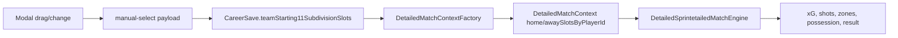

# Modal formation to match contract

Date: 2026-07-12

Goal: prove the formation editor is not cosmetic. Manual player moves and position changes must persist and affect the match engine.

## Required chain



## Verified state

| Layer | Evidence | Status |
|---|---|---|
| Front sends `customXPercent/customYPercent` | `squad-editor-modal.component.ts` and V25D99.20 specs | OK |
| Backend persists those coordinates | `LineupCommandUseCaseImplSubdivisionTest` | OK |
| Detailed context receives coordinates by player id | `DetailedMatchContextFactoryTest.carriesPersistedCustomSlotCoordinatesIntoMatchContextByPlayerId` | OK |
| Engine consumes coordinates | `DetailedSprintetailedMatchEngineFormationTest` | OK |

## Tests run

| Command | Result |
|---|---|
| `mvn -q -Dtest=DetailedMatchContextFactoryTest test` | OK |
| `mvn -q -Dtest=DetailedSprintetailedMatchEngineFormationTest test` | OK |
| `npm test -- --watch=false --include src/app/components/squad-editor-modal/squad-editor-modal.component.spec.ts` | OK, 121 success |

## Professional rule

- The modal must never be decorative.
- Every manual change must persist as a real slot/coordinate.
- Every real coordinate must reach the engine.
- One pixel may not visibly change a rounded UI number, but internal metrics must remain continuous and non-cliffy.
- Larger moves must produce measurable multi-seed differences.

## Modal movement rule

- A small manual move inside the original slot box must persist as `customXPercent/customYPercent`.
- The player must not snap back just because the cursor is still inside the same tactical rectangle.
- Snap-back is allowed only when the marker is dropped near the authored native point.
- This keeps two desirable behaviours together:
  - precise manual positioning for a professional DT experience;
  - easy return to baseline when the player is intentionally placed back on the native point.

## Visual QA run - 2026-07-12

Flow tested in the in-app browser:

1. Opened `http://localhost:4200/debug/test-harness`.
2. Opened the visual squad editor.
3. Moved `Aurelien Tchouameni` upward from canonical 4-4-2 midfield.
4. Closed and reopened the modal.
5. Selected `Athletic Club vs Real Madrid`.
6. Ran Scenario matrix with seed `12345`.
7. Reset positions.
8. Ran Scenario matrix again with the same seed.

Observed modal state:

| Step | Tchouameni position | Preview effect |
|---|---:|---|
| Canonical 4-4-2 | `left=38.85%`, `top=61%` | Tactical links `93/99`, MID `130%` |
| Manual move upward | `left=38.9797%`, `top=53.0992%` | Tactical links `91/99`, MID `129%`, reset button visible |
| Reopen after save | `left=38.9797%`, `top=53.0992%` | Position persisted |
| Reset positions | `left=38.85%`, `top=61%` | Tactical links back to `93/99`, MID back to `130%` |

Observed same-seed harness result:

| State | Score | Possession | Shots | xG |
|---|---:|---:|---:|---:|
| Manual Tchouameni move | `2-0` | `65% / 35%` | `50 / 15` | `2.51 / 0.50` |
| Reset/canonical | `2-0` | `67% / 33%` | `52 / 14` | `2.57 / 0.48` |

Interpretation:

- The modal movement is not cosmetic.
- The changed position persists after close/reopen.
- The same match/seed changes internal match metrics.
- The score did not change in this seed, which is acceptable for a small movement.
- Professional rule confirmed: small visual changes should alter probabilities/metrics, not force arcade-like result changes.

## Visual QA run - movement intensity curve - 2026-07-12

Player tested: `Aurelien Tchouameni` from canonical `4-4-2`.

| Case | Position | Chemistry | Tactical links | ATT | MID | DEF | Eff. team | Reading |
|---|---:|---:|---:|---:|---:|---:|---:|---|
| Base | `left=38.85%`, `top=61%` | `91` | `93` | `135` | `130` | `126` | `100%` | Baseline |
| Up ~8px | `left=38.9797%`, `top=58.8288%` | `91` | `93` | `135` | `130` | `126` | `100%` | Tiny move, rounded UI unchanged |
| Up ~25px | `left=38.9797%`, `top=53.0992%` | `91` | `91` | `135` | `129` | `126` | `100%` | Moderate effect, no cliff |
| Up ~55px | `left=38.9797%`, `top=42.988%` | `90` | `92` | `135` | `127` | `126` | `99%` | Stronger effect |
| Left ~55px | `left=22.8603%`, `top=61.5251%` | `91` | `92` | `134` | `128` | `126` | `99%` | Lateral displacement affects fit |
| Right ~55px | `left=55.0991%`, `top=61.5251%` | `91` | `91` | `134` | `128` | `126` | `99%` | Lateral displacement affects fit |
| Left + up diagonal | `left=22.8603%`, `top=49.7288%` | `90` | `90` | `134` | `127` | `126` | `99%` | Combined move hurts more |

Out-of-role stress cases:

| Case | Position | Chemistry | Tactical links | ATT | MID | DEF | Eff. team | Penalty visible | Reading |
|---|---:|---:|---:|---:|---:|---:|---:|---|---|
| `David Alaba` up ~120px | `left=38.9797%`, `top=42.1086%` | `90` | `93` | `135` | `130` | `121` | `99%` | Yes | Defender high weakens defense |
| `Kylian Mbappe` down ~120px | `left=38.9797%`, `top=57.8861%` | `90` | `90` | `116` | `135` | `138` | `99%` | Yes | Striker deep reduces attack heavily |

Same match / same seed stress comparison (`Real Madrid vs Athletic Club`, seed `12345`):

| State | Score | Possession | Shots | xG |
|---|---:|---:|---:|---:|
| `Kylian Mbappe` moved deep | `0-1` | `54% / 46%` | `36 / 22` | `1.34 / 0.74` |
| Reset/canonical | `0-1` | `56% / 44%` | `41 / 20` | `1.83 / 0.69` |

Interpretation:

- Movement curve is smooth: small move is almost invisible in rounded UI, medium/large moves become visible.
- Severe out-of-role movement affects preview and match metrics strongly.
- Moving a striker deep did not change the single-seed score, but it reduced xG and shots significantly, which is the professional behaviour expected.

## Visual QA run - player replacement in modal - 2026-07-12

Flow tested:

1. Opened `http://localhost:4200/debug/test-harness`.
2. Opened the visual squad editor.
3. Clicked the occupied striker marker.
4. Used the occupied-slot panel `Cambiar por...`.
5. Replaced `Kylian Mbappe` with `Endrick`.
6. Closed and reopened the modal.
7. Restored `Kylian Mbappe` as starter and reopened again.

Observed preview:

| State | Chemistry | Tactical links | ATT | MID | DEF | Bench check |
|---|---:|---:|---:|---:|---:|---|
| Base, `Kylian Mbappe` starter | `91/99` | `93/99` | `135%` | `130%` | `126%` | `Endrick` on bench |
| `Endrick` replaces `Kylian Mbappe` | `87/99` | `93/99` | `132%` | `130%` | `126%` | `Kylian Mbappe` on bench |
| Restored base | `91/99` | `93/99` | `135%` | `130%` | `126%` | `Endrick` on bench |

Interpretation:

- The player-change flow is not cosmetic: changing a starter changes chemistry and attacking strength immediately.
- The replacement persists after close/reopen.
- The original starter returns to the bench instead of being duplicated or lost.
- The click/select replacement path is now the reliable QA path.

Follow-up found while testing:

- A previously completed match detail may still show the old historical timeline until a fresh replay/simulation is executed. This is correct for historical data, but the harness needs a clearer "replay selected match with current lineup" path so QA does not confuse cached/completed results with the current modal state.
- Bench drag-and-drop remains awkward to validate with browser automation. The explicit `Cambiar por...` panel is the reliable professional path, and drag/drop should be treated as a convenience path to keep hardening.

## Harness improvement - current lineup replay card - 2026-07-12

Added a dedicated QA path in `/debug/test-harness`:

1. Select a match involving the user team.
2. Open the squad editor if needed.
3. Move players by pixels and/or replace starters.
4. Close the editor.
5. Click `Replay current lineup`.
6. Read the `Current lineup replay` card.

The card records:

- current persisted formation;
- seed;
- tactical style;
- starter list;
- score for/against;
- possession for/against;
- shots for/against;
- xG for/against;
- shot zones `central/wide/long` for/against.

Visual QA sample:

| Match | Lineup | Seed | Score | Possession | Shots | xG | Zones C/W/L |
|---|---|---:|---:|---:|---:|---:|---:|
| `Atletico Madrid vs Real Madrid` | current `4-4-2` Real Madrid | `12345` | `3-0` | `61% / 39%` | `31 / 15` | `1.39 / 0.59` | `15/9/7 / 10/3/2` |

Interpretation:

- QA no longer has to infer whether a completed timeline is stale.
- The card is explicit evidence that the selected match was replayed after the current visual lineup was persisted.
- This is the preferred first check after every modal change before running formation/scenario/multi-seed matrices.

## Player replacement replay comparison - 2026-07-12

Same match, same seed, same formation, different striker:

| State | Preview chemistry | Preview ATT | Score | Possession | Shots | xG | Zones C/W/L |
|---|---:|---:|---:|---:|---:|---:|---:|
| `Kylian Mbappe` starter | `91/99` | `135%` | `3-0` | `61% / 39%` | `31 / 15` | `1.39 / 0.59` | `15/9/7 / 10/3/2` |
| `Endrick` starter | `87/99` | `132%` | `2-0` | `61% / 39%` | `34 / 16` | `1.51 / 0.52` | `17/8/9 / 9/4/3` |

Reading:

- The modal preview reacts immediately to the player replacement.
- The replay card proves the engine receives the changed starter list.
- One seed can move in a surprising direction (`Endrick` had slightly higher xG here despite lower preview attack), so this is not enough for tuning by itself.
- Professional tuning should use this one-click replay as a smoke check, then run multi-seed summaries for average behaviour.

Fix added during QA:

- Panel A could show the previous detailed timeline while the replay card already showed the new replay. Added `inputRefreshToken` to `DetailedMatchDetailPageComponent` and increment it after replay mutations so the detail view refreshes even when `matchId` stays the same.

## Player replacement multi-seed comparison - 2026-07-12

Same match (`Atletico Madrid vs Real Madrid`), same `4-4-2`, same tactical style (`BALANCED`), seeds `12345..12354`.

| Starter | Seeds | Avg GF | Avg GA | Avg GD | Avg shots for | Avg xG for | Avg xG against | Avg xG diff |
|---|---:|---:|---:|---:|---:|---:|---:|---:|
| `Kylian Mbappe` | `10` | `0.70` | `0.30` | `+0.40` | `32.10` | `1.426` | `0.559` | `+0.867` |
| `Endrick` | `10` | `0.50` | `0.20` | `+0.30` | `29.60` | `1.250` | `0.585` | `+0.665` |
| `Endrick - Mbappe` | `10` | `-0.20` | `-0.10` | `-0.10` | `-2.50` | `-0.176` | `+0.026` | `-0.202` |

Reading:

- Over multiple seeds, the lower modal preview for `Endrick` now matches the engine trend.
- `Mbappe` produces more shots, more xG for, and better xG differential.
- A single seed can be noisy, but the 10-seed average points in the expected professional direction.
- Next harness improvement: turn this manual workflow into a reusable "Player swap matrix" control instead of doing it through repeated UI clicks.

## Harness improvement - current lineup multi-seed - 2026-07-12

Added a reusable QA smoke button in `/debug/test-harness`:

- `Current lineup multi-seed`

What it does:

1. Reads the currently persisted visual lineup.
2. Applies the selected tactical style.
3. Replays the selected match across consecutive deterministic seeds.
4. Fetches Detailed detail after each replay.
5. Shows a user-team summary card with:
   - average goals for/against;
   - average goal difference;
   - average possession;
   - average shots for/against;
   - average xG for/against;
   - average xG difference;
   - average shot zones `central/wide/long` for and against;
   - starters used by the persisted lineup.

Implementation notes:

- Default smoke size is 5 seeds from the seed input (`12345` means `12345..12349`).
- Each seed has a timeout, so a slow/stuck replay does not lock the harness forever.
- This is the automatic version of the manual Mbappe-vs-Endrick average check.
- The full A/B player comparison still needs the next layer: `Player swap matrix`, where the harness chooses slot, player A/B and seed range automatically.

## Harness improvement - automatic player swap matrix - 2026-07-12

Added a first reusable A/B comparison button in `/debug/test-harness`:

- `Player swap matrix`

Current behavior:

1. Reads the persisted visual lineup.
2. Reads the full squad.
3. Picks the first attacking starter with a persisted slot.
4. Picks the best available bench attacker by `attack + technique + speed`.
5. Runs baseline samples across deterministic seeds.
6. Persists the swapped lineup through the real `/career/lineup/manual-select` endpoint, preserving the starter's `subdivisionId` and custom coordinates.
7. Runs swapped samples across the same seeds.
8. Restores the original persisted lineup and slots.
9. Shows deltas:
   - goals for/against;
   - goal difference;
   - shots for/against;
   - xG for/against;
   - xG difference.

Important:

- This deliberately uses the same persisted-lineup path as the modal, not a fake in-memory engine tweak.
- Default sample size is 3 seeds to keep the harness usable while replay/detail endpoints are still expensive.
- This is the first automated version. Next refinement should expose slot/player selectors so QA can choose exactly `Mbappe vs Endrick`, defender swaps, midfield swaps, etc.

## Harness improvement - manual player swap selectors - 2026-07-12

The `Player swap matrix` now has two selectors:

- `Swap slot`: a current non-GK starter with persisted slot id.
- `Swap player`: an available non-GK bench player.
- `Swap seeds`: editable seed count for the A/B comparison.

Behavior:

- If both are left on `Auto`, the previous automatic attacker-vs-bench-attacker path is used.
- If a starter slot is selected, that exact player/slot is used as the baseline slot.
- If a bench player is selected, that exact player is inserted into the selected starter's slot.
- `Swap seeds` defaults to `3`, clamps to `1..50`, and runs consecutive seeds from the main seed input.
- If the selected option disappears after a lineup change, the selector safely falls back to `Auto`.

This makes QA capable of testing exact hypotheses such as:

- `Mbappe` vs `Endrick` in the same striker slot.
- A fullback swap in a wide-defender slot.
- A midfielder swap while keeping the same visual coordinates.
- Any modal/manual-position change, followed by a precise A/B replay comparison.

## Visual smoke - Mbappe vs Endrick through manual selectors - 2026-07-12

Manual selector flow tested in `/debug/test-harness`:

1. Selected `Atletico Madrid vs Real Madrid`.
2. `Swap slot`: `Kylian Mbappe (ATT) · S05-1`.
3. `Swap player`: `Endrick (ATT) · atk 78 · tech 78 · pace 78`.
4. Ran `Player swap matrix`.

Result card:

| Comparison | Slot | Seeds | Delta GF | Delta GA | Delta GD | Delta shots | Delta xG for | Delta xG diff |
|---|---|---:|---:|---:|---:|---:|---:|---:|
| `Kylian Mbappe` vs `Endrick` | `S05-1` | `12345..12347` | `-0.33` | `-0.33` | `±0.00` | `-1.67` | `-0.07` | `-0.11` |

Baseline/swapped xG:

- Baseline `Mbappe`: `1.29 / 0.52`.
- Swapped `Endrick`: `1.22 / 0.56`.

Restoration check:

- After reload, `Kylian Mbappe` appeared again in `Swap slot` starters.
- `Endrick` appeared again in `Swap player` bench options.
- This confirms the matrix restored the persisted lineup after the A/B test.

## Visual calibration - Mbappe vs Endrick with 10 seeds - 2026-07-12

Manual selector flow tested again with a larger sample:

1. Selected `Atletico Madrid vs Real Madrid`.
2. `Swap slot`: `Kylian Mbappe (ATT) · S05-1`.
3. `Swap player`: `Endrick (ATT) · atk 78 · tech 78 · pace 78`.
4. `Swap seeds`: `10`.
5. Ran `Player swap matrix`.

Result card:

| Comparison | Slot | Seeds | Delta GF | Delta GA | Delta GD | Delta shots | Delta xG for | Delta xG diff |
|---|---|---:|---:|---:|---:|---:|---:|---:|
| `Kylian Mbappe` vs `Endrick` | `S05-1` | `12345..12354` | `-0.27` | `-0.16` | `-0.11` | `-1.67` | `-0.13` | `-0.15` |

Baseline/swapped xG:

- Baseline `Mbappe`: `1.43 / 0.56`.
- Swapped `Endrick`: `1.29 / 0.58`.

Reading:

- With 10 seeds, `Endrick` remains worse than `Mbappe` in shots, xG for and xG differential.
- This matches the professional expectation and the previous 3-seed smoke, but with a more stable sample.
- Runtime is noticeably longer because the UI currently performs real replay/detail cycles for both baseline and swapped samples.

Restoration check:

- After the run completed and the page reloaded, `Kylian Mbappe` appeared again in starter slot options.
- `Endrick` appeared in bench options.

## Harness optimization - backend in-memory player swap summary - 2026-07-12

The `Player swap matrix` no longer needs to temporarily persist a swapped
lineup and then restore it.

New backend endpoint:

- `POST /api/v1/test-harness/career/match/{matchId}/player-swap-matrix/summary`

Request:

```json
{
  "starterPlayerId": "starter-session-player-id",
  "benchPlayerId": "bench-session-player-id",
  "slotId": "S05-1",
  "seedStart": 12345,
  "seedCount": 10
}
```

Behavior:

- Builds the baseline Detailed context from the current persisted modal/lineup state.
- Builds a second in-memory context where the bench player replaces the starter
  in the same tactical slot.
- Transfers the starter's persisted `LineupSlotDTO` to the bench player so the
  visual slot/free-position is preserved.
- Runs baseline and swapped simulations with the same seed set.
- Returns averages and deltas for goals, shots and xG.
- Does not save fixtures, match detail, lineup or career state.

Frontend behavior:

- The UI still uses the same `Swap slot`, `Swap player` and `Swap seeds`
  selectors.
- The button now calls the backend summary endpoint.
- Because the comparison is in-memory, there is no restore step and no risk of
  leaving the user's lineup accidentally swapped after a failed run.

Validation:

- Backend compile: `mvn -q -DskipTests compile` ✅
- Harness component spec: `npm test -- --watch=false --include src/app/features/debug/test-harness/test-harness-page.component.spec.ts` ✅ (`46 SUCCESS`)
- Frontend build: `npm run build` ✅

## Visual smoke - optimized player swap card with tactical zones - 2026-07-12

After restarting the backend from the current workspace code, the browser smoke
for `/debug/test-harness` passed:

- Match: `Atletico Madrid vs Real Madrid`
- Player swap: `Jude Bellingham` vs `Vinicius Junior`
- Slot: `S05-3`
- Seeds: `12345..12347`

Observed card:

| Metric | Value |
|---|---:|
| Delta GF | `±0.00` |
| Delta GA | `+0.34` |
| Delta GD | `-0.34` |
| Delta Shots | `+9.00` |
| Delta Possession | `-4.33%` |
| Delta xG For | `+0.33` |
| Delta xG Diff | `+0.24` |
| Delta Zones For C/W/L | `+5.00/+1.67/+2.34` |
| Delta Zones Against C/W/L | `+2.00/+0.34/+1.33` |

Baseline/swapped line:

- xG: `1.29 / 0.52` -> `1.62 / 0.60`
- possession: `61%` -> `57%`
- zones for C/W/L: `15.33/7.33/7.33` -> `20.33/9.00/9.67`
- zones against C/W/L: `10.67/1.33/3.67` -> `12.67/1.67/5.00`

Reading:

- The swap now has visible tactical consequences, not only a total xG delta.
- In this sample, the swapped player increased attacking volume and xG, but also
  increased shots conceded and reduced possession.
- This is the kind of tradeoff the harness needs to expose for manager-quality
  decisions.

## Position pixel matrix - one-pixel movement smoke - 2026-07-12

Added backend endpoint:

- `POST /api/v1/test-harness/career/match/{matchId}/position-pixel-matrix/summary`

Request:

```json
{
  "playerId": "starter-session-player-id",
  "targetXPercent": 50,
  "targetYPercent": 17,
  "seedStart": 12345,
  "seedCount": 3
}
```

Behavior:

- Builds the baseline Detailed context from the persisted visual lineup.
- Builds a moved in-memory context where only that player's `LineupSlotDTO`
  coordinates change.
- Does not persist lineup, fixture, detail or career state.
- Aggregates goals, shots, possession, xG and attacking zone distribution across
  the same seeds.

Frontend:

- Added `Position pixel matrix` button.
- It uses the selected `Swap slot` starter when present; otherwise auto-picks
  the same attacking starter as the swap matrix.
- First preset: move the player 1 pixel toward attack (`targetY = fromY - 1`).

Visual smoke:

- Match: `Atletico Madrid vs Real Madrid`
- Player: `Jude Bellingham (ATT)`
- Slot: `S05-3`
- Move: `50/18 -> 50/17`
- Seeds: `12345..12347`

Observed:

| Metric | Value |
|---|---:|
| Delta Shots | `-1.00` |
| Delta Poss | `-2.33%` |
| Delta xG For | `+0.04` |
| Delta xG Diff | `+0.02` |
| Delta Zones C/W/L | `+1.00/-2.00/±0.00` |
| xG For | `1.29 -> 1.33` |

Reading:

- A 1-pixel movement now produces a small but measurable tactical effect.
- The effect is not a giant discontinuity: xG changed by `+0.04`, which is a
  reasonable sensitivity smoke.
- The UI now also exposes a preset table, so this check is no longer a single
  hard-coded move.

## Position movement presets matrix - visual smoke - 2026-07-12

Frontend behavior:

- The harness button is now `Position presets matrix`.
- It reuses the same in-memory backend endpoint for each preset.
- The table compares the same player, slot and seed range across multiple
  target coordinates.
- This keeps the manager contract visible: tiny movement, bigger movement,
  lateral movement and zone-crossing movement should not collapse into the same
  match profile.

Visual smoke in `/debug/test-harness`:

- Match: `Atletico Madrid vs Real Madrid`
- Player: `Jude Bellingham (ATT)`
- Slot: `S05-3`
- Baseline coordinate: `50/18`
- Seeds: `12345..12347`

Observed preset table:

| Move | Coord. | Delta xG For | Delta Shots | Delta Poss | Delta Zones C/W/L |
|---|---:|---:|---:|---:|---:|
| 1px forward | `50/18 -> 50/17` | `+0.04` | `-1.00` | `-2.33%` | `+1.00/-2.00/±0.00` |
| 5px forward | `50/18 -> 50/13` | `+0.01` | `-1.33` | `-3.33%` | `+0.34/-0.66/-1.00` |
| 5px deeper | `50/18 -> 50/23` | `+0.02` | `+0.67` | `-2.33%` | `±0.00/-0.33/+1.00` |
| 5px wide | `50/18 -> 45/18` | `+0.07` | `+0.67` | `-0.66%` | `+0.67/-0.33/+0.34` |
| 5px center | `50/18 -> 55/18` | `-0.03` | `-1.33` | `-3.33%` | `-0.33/-0.33/-0.66` |
| big zone cross | `50/18 -> 50/36` | `-0.28` | `-6.33` | `-5.66%` | `-3.33/-2.66/-0.33` |

Reading:

- Small pixel moves now produce measurable but not arcade-level changes.
- Lateral moves are visible in possession, shots and zone distribution.
- A bigger move into another tactical band has a much stronger negative effect,
  which is the right direction for professional-feeling tuning.
- The harness now chooses representatives from different lines (`DEF`, `MID`,
  `ATT`) and runs the same preset table for each.

## Position movement presets matrix - multi-line smoke - 2026-07-12

Frontend behavior:

- `Position presets matrix` now runs up to three non-GK starters:
  - one defender representative;
  - one midfielder representative;
  - one attacker representative.
- If a manual `Swap slot` starter is selected, that player is included first
  and duplicates are removed.
- The table has a `Player` column so line-specific movement sensitivity is
  visible.

Visual smoke in `/debug/test-harness`:

- Match: `Atletico Madrid vs Real Madrid`
- Seeds: `12345..12347`
- Rows generated: `18` (`3 players x 6 movement presets`)

Observed representatives:

| Line | Player | Baseline coord. |
|---|---|---:|
| DEF | `Dani Carvajal` | `50/78` |
| MID | `Federico Valverde` | `50/52` |
| ATT | `Jude Bellingham` | `50/18` |

Interesting smoke readings:

| Player | Move | Coord. | Delta xG For | Delta Shots | Delta Poss | Reading |
|---|---|---:|---:|---:|---:|---|
| Dani Carvajal | 1px forward | `50/78 -> 50/77` | `+0.34` | `+5.00` | `+5.67%` | Possibly too large for a tiny defender move; investigate sensitivity/thresholds. |
| Dani Carvajal | 5px forward | `50/78 -> 50/73` | `+0.01` | `-0.33` | `+2.00%` | Larger move does not scale monotonically with 1px; useful bug/tuning signal. |
| Federico Valverde | 5px forward | `50/52 -> 50/47` | `+0.17` | `+1.67` | `+2.34%` | Midfield forward movement affects attack reasonably. |
| Federico Valverde | big zone cross | `50/52 -> 50/34` | `+0.14` | `-0.33` | `-3.66%` | Zone crossing changes possession and distribution. |
| Jude Bellingham | big zone cross | `50/18 -> 50/36` | `-0.28` | `-6.33` | `-5.66%` | Attacker dropped into another band is strongly punished. |

Reading:

- The visual modal data now reaches the match engine for multiple player lines.
- The harness is exposing exactly the kind of tuning questions we need:
  small defender moves currently look more discontinuous than desired.
- Next recommended engine pass: smooth line/zone influence so 1px defender moves
  do not create larger deltas than coherent 5px moves unless there is a clear
  tactical reason.

## Harness coordinate-origin fix - 2026-07-12

Bug found while investigating the apparent defender sensitivity cliff:

- The position matrix frontend/backend used fallback coordinates like `50/78`
  when a slot had no persisted `customXPercent/customYPercent`.
- That was wrong for canonical formation slots. Example: `Dani Carvajal` in
  slot `S22-2` is canonically around `16.67/83.32`, not `50/78`.
- So the old "1px forward" smoke was not really a 1px movement; it also moved
  the defender from a lateral channel into the center.

Fix:

- Backend `position-pixel-matrix/summary` now resolves `fromX/fromY` from:
  1. persisted custom coordinates;
  2. canonical subdivision coordinates;
  3. role fallback only if the slot cannot be parsed.
- Frontend `Position presets matrix` uses the same canonical fallback before
  generating presets.

Post-fix visual smoke in `/debug/test-harness`:

| Player | Move | Coord. | Delta xG For | Delta Shots | Delta Poss | Reading |
|---|---|---:|---:|---:|---:|---|
| Dani Carvajal | 1px forward | `16.67/83.32 -> 16.67/82.32` | `±0.00` | `±0.00` | `±0.00%` | Correct: tiny DEF move no longer creates a fake cliff. |
| Dani Carvajal | 5px forward | `16.67/83.32 -> 16.67/78.32` | `+0.12` | `+2.00` | `+2.67%` | Larger forward move has visible effect. |
| Federico Valverde | 1px forward | `16.67/61.11 -> 16.67/60.11` | `±0.00` | `±0.00` | `±0.00%` | Tiny MID move stable. |
| Federico Valverde | 5px forward | `16.67/61.11 -> 16.67/56.11` | `+0.09` | `+2.67` | `+0.67%` | Moderate MID move affects attack. |
| Jude Bellingham | 1px forward | `61.11/16.67 -> 61.11/15.67` | `+0.05` | `+0.33` | `+1.34%` | Tiny ATT move has small visible effect. |
| Jude Bellingham | big zone cross | `61.11/16.67 -> 50/34.67` | `-0.27` | `-6.33` | `-5.66%` | Big tactical reposition still matters strongly. |

Reading:

- The engine did not need smoothing for this case yet; the test harness was
  creating wrong target coordinates.
- The corrected matrix now behaves much closer to a professional manager tool:
  tiny moves are stable, 5px moves can matter, and large zone-crossing moves are
  significant.

## Position matrix read column - 2026-07-12

Added a `Read` column to the visual harness table so calibration work is faster:

- `Stable`: tiny/no meaningful change.
- `Visible`: normal tactical effect.
- `Strong`: large effect, expected mainly on bigger zone-crossing moves.
- `Check`: suspicious sensitivity; repeat with more seeds before tuning.

Current visual smoke (`Atletico Madrid vs Real Madrid`, seeds `12345..12347`):

| Row | Read | Reason |
|---|---|---|
| Dani Carvajal `1px forward` | `Stable` | Correct after canonical coordinate fix. |
| Dani Carvajal `5px forward` | `Visible` | Larger defensive-line move affects match metrics. |
| Federico Valverde `5px forward` | `Visible` | Midfielder advance affects attack. |
| Jude Bellingham `1px forward` | `Check` | `+0.05 xG`, `+1.34pp possession` and zone shift may be seed noise or ATT sensitivity. |
| Jude Bellingham `big zone cross` | `Strong` | Dropping an attacker into another band has a large tactical penalty. |

Next calibration rule:

- Do not tune the engine from a 3-seed `Check` row alone.
- First repeat suspicious rows with a larger seed count (`20-50`) to separate
  real sensitivity from deterministic-seed variance.

## Sensitivity check - high-seed micro-movement - 2026-07-12

Added a dedicated `Sensitivity check` button:

- Uses the same DEF/MID/ATT representatives.
- Runs only 1px micro-movements:
  - `1px forward`;
  - `1px deeper`;
  - `1px wide`;
  - `1px center`.
- Forces at least `20` seeds and caps at `50`, instead of running all big
  presets. This keeps runtime practical while validating suspicious rows.

Visual smoke:

- Match: `Atletico Madrid vs Real Madrid`
- Seeds: `12345..12364`
- Rows: `12` (`3 players x 4 micro-movements`)

Observed:

| Player | Move | Delta xG For | Delta Shots | Delta Poss | Read |
|---|---|---:|---:|---:|---|
| Dani Carvajal | 1px forward | `±0.00` | `±0.00` | `-0.10%` | `Stable` |
| Dani Carvajal | 1px center | `±0.00` | `±0.00` | `±0.00%` | `Stable` |
| Federico Valverde | 1px forward | `±0.00` | `±0.00` | `±0.00%` | `Stable` |
| Federico Valverde | 1px deeper | `±0.00` | `-0.05` | `-0.05%` | `Stable` |
| Jude Bellingham | 1px forward | `+0.01` | `+0.20` | `+0.30%` | `Stable` |
| Jude Bellingham | 1px wide | `+0.03` | `+0.70` | `+0.30%` | `Stable` |

Reading:

- The previous 3-seed `Check` for `Jude Bellingham 1px forward` did not survive
  the higher-seed sensitivity check.
- No engine tuning is justified for 1px movement sensitivity right now.
- Next calibration should focus on 5px and big-zone movements: are their
  `Visible`/`Strong` effects football-plausible across several matches and
  teams?

## Calibration sweep - multi-match 5px and big-zone movements - 2026-07-12

Added `Calibration sweep`:

- Runs across up to 3 user-team matches.
- Uses DEF/MID/ATT representatives.
- Tests medium/large presets:
  - `5px forward`;
  - `5px deeper`;
  - `5px wide`;
  - `5px center`;
  - `big zone cross`.
- Forces `10-30` seeds so the sweep is broader than a one-match smoke but still
  usable from the browser.

Visual smoke:

- Matches: `R1 vs Atletico Madrid`, `R2 vs Athletic Club`, `R3 vs Barcelona`
- Seeds: `12345..12354`
- Rows: `45` (`3 matches x 3 players x 5 movements`)

Key observations:

| Row | Read | Notes |
|---|---|---|
| Dani Carvajal, 5px forward vs Atletico/Athletic | `Stable` | Small defensive advance is not over-amplified. |
| Dani Carvajal, 5px forward vs Barcelona | `Visible` | Stronger opponent/context creates a visible effect. |
| Dani Carvajal, big zone cross | `Visible` | Moving a defender into a central higher band affects match shape. |
| Federico Valverde, 5px forward | `Stable/Visible` | Midfield advance has modest contextual effect. |
| Federico Valverde, big zone cross | `Stable/Visible` | Bigger midfield reposition is not exploding. |
| Jude Bellingham, 5px forward/wide | `Stable/Visible` | Attacker micro-tactical changes are noticeable but controlled. |
| Jude Bellingham, big zone cross | `Strong` vs Atletico, `Visible` vs Athletic/Barcelona | Dropping attacker into a different band is consistently meaningful. |

Reading:

- No `Check` rows appeared in the sweep.
- Current medium/large position sensitivity looks plausible enough to keep
  testing across more teams before tuning engine constants.
- The next useful improvement is not immediate engine tuning; it is making the
  sweep easier to summarize/count (`Stable/Visible/Strong/Check` totals) so
  future calibrations are faster.

## Harness optimization - player swap zones and possession - 2026-07-12

The optimized player-swap endpoint now also returns tactical distribution
aggregates:

- average user possession;
- average central / wide / long shots for;
- average central / wide / long shots against;
- average central / wide / long xG for;
- average central / wide / long xG against;
- deltas for all of those values between swapped and baseline.

The frontend adapter now feeds the real possession and zone values into the
baseline/swapped cards. The card no longer shows placeholder zeroes for these
fields.

This matters because a player swap can now be judged not only by total xG, but
also by how it changes the team's attacking channels and defensive exposure.

Validation:

- Backend compile: `mvn -q -DskipTests compile` ✅
- Harness component spec: `npm test -- --watch=false --include src/app/features/debug/test-harness/test-harness-page.component.spec.ts` ✅ (`46 SUCCESS`)
- Frontend build: `npm run build` ✅

## Position movement read summary - 2026-07-12

The `Position movement presets` table now includes automatic summary badges:

- `Stable`
- `Visible`
- `Strong`
- `Check`

The badges reuse the exact same per-row classification logic as the `Read`
column, so the summary is a fast smoke-test dashboard rather than a second,
possibly inconsistent metric.

Visual smoke:

- Page: `/debug/test-harness`
- Match: `Atletico Madrid vs Real Madrid`, completed
- Action: `Sensitivity check`
- Result: `Stable 12 / Visible 0 / Strong 0 / Check 0`

Interpretation:

- The 1px DEF/MID/ATT micro-movement set is currently stable across the high-seed smoke.
- A future tuning pass should focus first on rows marked `Check`, then on whether
  `Visible` and `Strong` feel football-realistic for 5px and bigger zone-cross moves.

Validation:

- Frontend build: `npm run build` OK.
- Harness component spec: `npm test -- --watch=false --include src/app/features/debug/test-harness/test-harness-page.component.spec.ts` OK (`46 SUCCESS`).

## Defensive channel labs - 2026-07-13

Goal:

- Prove that defensive weaknesses are not generic.
- If the left defensive side is weak, the opponent should benefit more when
  attacking that side.
- If the right defensive side is weak, the opponent should benefit more when
  attacking that side.
- If the centre backs are weak, central play should become more dangerous.
- If both wide defenders are weak, wide play should become more dangerous.

Harness setup:

- Match: `Real Betis vs Real Madrid`.
- Formation base: `4-4-2`.
- Matrix: `scenario-matrix/summary`.
- Seeds: `12345..12364` (`20` seeds).
- Each lab uses prepare -> matrix -> restore, so the smoke squad returns to
  its default state after the run.

Result:

| Lab | Opponent scenario | Opp. xG base | Opp. xG lab | Delta | Focus metric | Base | Lab | Delta |
| --- | --- | ---: | ---: | ---: | --- | ---: | ---: | ---: |
| weak-left | opponent-left | 0.002 | 0.083 | +0.081 | leftWideXg | 0.052 | 0.154 | +0.102 |
| weak-right | opponent-right | 0.004 | 0.079 | +0.075 | rightWideXg | 0.064 | 0.146 | +0.082 |
| weak-cb | opponent-central | 0.039 | 0.138 | +0.099 | centralXg | 0.068 | 0.221 | +0.153 |
| weak-wide | opponent-wide | 0.003 | 0.057 | +0.054 | wideXg | 0.032 | 0.100 | +0.068 |

Verdict:

- The channel model behaves in the expected direction.
- Left/right/central/wide defensive weaknesses are visible in the matching
  opponent attack channel.
- This is good enough to continue with broader match-engine calibration without
  treating channel defense as a blocker.

## Player swap harness and DRIBBLER calibration - 2026-07-13

Goal:

- Make starter/bench changes measurable without letting one skill dominate the
  whole match.
- Separate two readings in the harness:
  - full match impact;
  - pre-auto-sub impact, minutes `1..59`, before automatic substitutions start.

Harness change:

- `player-swap-matrix/summary` now also returns:
  - `preAutoSubDeltaShotsFor`
  - `preAutoSubDeltaShotsAgainst`
  - `preAutoSubDeltaXgFor`
  - `preAutoSubDeltaXgAgainst`
  - `preAutoSubDeltaXgDiff`
- The debug harness shows this as a `Pre-auto-sub 1'-59'` line in Panel E.

Calibration:

- The previous DRIBBLER chance-volume curve was:
  - `1.0 + skill / 300.0`
  - DRIBBLER 95 => `+31.7%` team chance volume.
- New curve:
  - `1.0 + skill / 600.0`
  - DRIBBLER 95 => `+15.8%` team chance volume.

Why:

- In the Real Madrid smoke data, Vinicius has elite DRIBBLER/SPEEDSTER/SHOOTER
  skills while Bellingham has a different skill profile.
- Before this calibration, `Bellingham -> Vinicius` produced an oversized
  player-swap result: about `+7.67` shots and `+0.272` xG over 100 seeds.
- After the softer DRIBBLER curve, the same swap gives:
  - full match: `+3.71` shots, `+0.081` xG for, `+0.043` xG diff;
  - pre-auto-sub: `+2.58` shots, `+0.063` xG for, `+0.047` xG diff.

Verdict:

- Player changes still matter.
- Skill identity still matters.
- The effect is less arcade-like and easier to evaluate professionally in the
  harness.

Visual validation:

- Opened `/debug/test-harness`.
- Selected `Real Betis vs Real Madrid`.
- Set player-swap seeds to `20`.
- Ran `Player swap matrix`.
- Panel E displayed:
  - `Jude Bellingham vs Vinicius Junior`;
  - `seeds 12345..12364`;
  - the new `Pre-auto-sub 1'-59'` line.

20-seed visual result:

| Metric | Full match | Pre-auto-sub 1..59 |
| --- | ---: | ---: |
| Delta shots for | +3.30 | +1.95 |
| Delta shots against | +1.85 total zones against | +1.55 |
| Delta xG for | +0.06 | +0.04 |
| Delta xG diff | +0.01 | -0.01 |

100-seed API player-swap line matrix:

| Line | Swap | Delta shots for | Delta shots against | Delta xG for | Delta xG against | Delta xG diff |
| --- | --- | ---: | ---: | ---: | ---: | ---: |
| ATT | Mbappe -> Endrick | -0.98 | +0.04 | -0.085 | +0.007 | -0.092 |
| ATT/WIDE | Bellingham -> Vinicius | +3.71 | +0.73 | +0.081 | +0.038 | +0.043 |
| MID | Kroos -> Modric | 0.00 | 0.00 | 0.000 | 0.000 | 0.000 |
| DEF | Lucas Vazquez -> Rudiger | -0.10 | -0.18 | +0.003 | -0.012 | +0.015 |
| DEF | David Alaba -> Militao | +0.01 | -0.05 | +0.001 | +0.001 | 0.000 |

Reading:

- Attack swaps are visible.
- Elite wide/skill swaps are visible but no longer absurd after DRIBBLER
  softening.
- Kroos -> Modric is neutral because the current smoke/session data makes them
  effectively equal for the engine.
- Defensive swaps are currently subtle, which is acceptable for similar-quality
  Real Madrid defenders but should be tested later with a stronger weak/elite
  defender contrast.

## Controlled player-line swaps - 2026-07-13

Goal:

- Validate the engine with deliberately separated player quality, not only with
  realistic squads where many players are close in attributes.
- Cover all manager-relevant lines:
  - striker / attacker;
  - midfielder;
  - defender;
  - goalkeeper.

Method:

- Match: `Real Betis vs Real Madrid`.
- Seeds: `100`.
- Endpoint: `player-swap-matrix/summary`.
- Existing labs used:
  - offensive lab: Mbappe down, Endrick up;
  - defensive lab: Carvajal strong, Fran Garcia weak.
- Temporary stat injection used for:
  - Kroos weak vs Modric creator;
  - Courtois elite vs Kepa weak.
- All temporary stat injections were restored after the run.

Results:

| Line | Controlled swap | Full delta shots for | Full delta shots against | Full delta xG for | Full delta xG against | Full delta xG diff | Pre-auto-sub xG diff |
| --- | --- | ---: | ---: | ---: | ---: | ---: | ---: |
| ATT | Mbappe down -> Endrick up | +6.30 | +0.58 | +0.430 | +0.011 | +0.419 | +0.226 |
| MID | Kroos weak -> Modric creator | +1.49 | +0.17 | +0.174 | -0.013 | +0.187 | +0.070 |
| DEF | Carvajal strong -> Fran weak | -1.26 | +2.18 | -0.073 | +0.159 | -0.232 | -0.200 |
| GK | Courtois elite -> Kepa weak | -1.22 | +2.08 | +0.275 | +0.570 | -0.295 | -0.282 |

Reading:

- Attacker quality clearly changes team chance/xG output.
- Midfield creative quality changes team xG in the expected direction.
- Defender downgrade increases opponent shots/xG and hurts xG diff.
- Goalkeeper downgrade strongly increases opponent xG and hurts xG diff.
- The modal-to-engine path is now testable across all four lines with stable
  deterministic seeds.

Open calibration note:

- GK downgrade also showed a positive `deltaXgFor` in this run. The important
  net result is still negative because `deltaXgAgainst` rises more, but later
  calibration should inspect whether GK quality is affecting match flow too
  broadly or whether this is seed distribution.

## Player quality weight calibration - 2026-07-13

Goal:

- Make player swaps feel real in the match engine.
- Avoid the manager problem where the modal says a change happened, but the
  match barely reacts.

Engine adjustment:

- Attack chance volume now considers both:
  - the strongest attacking player in the current possession context;
  - the aggregate attacking quality of the lineup/slots.
- The aggregate blend is protected with `Math.max(...)`, so it does not lower
  the previous single-star-player baseline.
- Defensive roster quality now has a wider chance-volume range:
  - old: `0.94..1.12`
  - new: `0.86..1.24`

Smoke match:

- User team: Real Madrid.
- Match: `Real Betis vs Real Madrid`.
- Formation: `4-4-2`.
- Seeds: `12345..12374` (`30` seeds).

Player swap smoke:

| Case | Main reading |
| --- | --- |
| Dani Carvajal `82` -> Raul Asencio `71` | xG diff moved `-0.057`; xG against rose `+0.021`; signal exists but is still subtle. |
| Kylian Mbappe `88` -> Endrick `78` | xG for moved `-0.111`; shots for moved `-1.26`; attacking quality is now visible. |

Scenario matrix smoke:

| Scenario | Main reading |
| --- | --- |
| `m45-wide` | Wide shots rose about `+2.83`, wide xG rose about `+0.098`, central xG fell. |
| `m45-central` | Central shots rose about `+3.97`, central xG rose about `+0.228`, wide xG fell. |
| Opponent left/right flank | Opponent wide distribution moved to the requested side. |
| Formation change to `4-3-3` | User wide xG rose and central/wide mix changed. |

Validation:

- Backend compile: OK.
- Focused backend tests:
  `DetailedSprintetailedMatchEngineFormationTest,DetailedMatchContextFactoryTest` OK.

Known debt:

- `DetailedModelTuningDiagnosticTest.measureGoalDistribution_lambdaInReasonableBand`
  still reports low lambda around `0.2865` vs the minimum `0.3`.
- This is a global scoring/conversion tuning issue, not a modal wiring issue.
- Defensive swaps now move in the right direction, but should probably become
  more readable when the player gap is large.

## Defensive weak-link calibration - 2026-07-13

Problem:

- A defensive substitution was mathematically correct but too diluted by a
  plain back-line average.
- Example: replacing one strong defender with a much weaker one barely moved
  the opponent's xG because four/five other defensive players absorbed the
  average.

Engine adjustment:

- Defensive aggregate keeps the average as the base, but now blends in the
  weakest defender when tactical lineup slots are present:
  - `55%` defensive average;
  - `45%` weakest defensive link.
- If there are no tactical slots/custom positions, legacy behavior is preserved.
- Channel defense also leans more on the actual local channel:
  - `80%` channel defense;
  - `20%` global defense.

Smoke match:

- User team: Real Madrid.
- Match: `Real Betis vs Real Madrid`.
- Swap: Dani Carvajal `82` -> Raul Asencio `71`.
- Seeds: `12345..12444` (`100` seeds).

Result:

| Metric | Delta |
| --- | ---: |
| xG against | `+0.045` |
| shots against | `+0.77` |
| xG diff | `-0.032` |
| central xG against | `+0.035` |
| wide xG against | `+0.008` |

Reading:

- The defensive downgrade is now visible over a stable seed sample.
- It is still bounded: one substitution worsens the team, but does not
  automatically collapse the match.

Validation:

- Focused backend tests:
  `DetailedSprintetailedMatchEngineFormationTest,DetailedMatchContextFactoryTest` OK.

## Position pixel defensive-channel visibility - 2026-07-13

Problem:

- `position-pixel-matrix/summary` already calculated opponent zone data through
  `SwapAccumulator`, but the response did not expose the against-side breakdown.
- That made it hard to validate the manager question: "if I leave a flank open,
  do they attack me there?"

Change:

- `PositionPixelMatrixSummaryRow` now exposes:
  - central/wide/long shots against;
  - central/wide/long xG against;
  - matching deltas.
- Panel E now shows:
  - `Delta Zones Ag. C/W/L`;
  - `Delta xG Ag. C/W/L`;
  - xG against baseline -> moved.

Stable API smoke:

- Match: `Real Betis vs Real Madrid`.
- Formation: Real Madrid `4-4-2`.
- Seeds: `100`.

| Move | xG against | Shots against | Against zones C/W/L | Against xG C/W/L | Reading |
| --- | ---: | ---: | --- | --- | --- |
| Carvajal from fullback to center | `-0.013` | `+0.04` | `-0.44/+0.50/-0.02` | `-0.024/+0.011/+0.000` | Wide exposure rises, central protection improves, total compensates. |
| Carvajal too high | `+0.047` | `+1.21` | `+0.62/+0.45/+0.14` | `+0.033/+0.012/+0.002` | Clear defensive punishment. |
| Lucas from fullback to center | `-0.027` | `-0.15` | `-0.42/+0.37/-0.10` | `-0.028/+0.004/-0.002` | Wide exposure rises, central protection improves, total compensates. |
| Lucas too high | `-0.009` | `+0.63` | `+0.19/+0.33/+0.11` | `-0.012/+0.003/+0.000` | Shot volume punishment appears; xG total remains noisy. |

Reading:

- The harness can now diagnose *where* the opponent changes, not only whether
  total xG changed.
- Pulling a fullback into the center is not always globally worse because it can
  improve central defense while exposing the flank. The new breakdown makes that
  tradeoff visible.
- Pushing a fullback too high is punished more clearly: more shots against and,
  for Carvajal's side, higher xG against.

Validation:

- Backend focused tests OK.
- Harness component spec OK (`46 SUCCESS`).
- Frontend build OK, with existing unrelated Angular warnings.

Visual validation:

- Opened `/debug/test-harness` in the in-app browser.
- Selected `Real Betis vs Real Madrid`.
- Ran `Position presets matrix`.
- Panel E displayed the new defensive cards:
  - `Delta Zones Ag. C/W/L`;
  - `Delta xG Ag. C/W/L`.
- Position movement summary rendered:
  `Stable 12 / Visible 5 / Strong 1 / Check 0`.

## Position movement tactical read table - 2026-07-13

Goal:

- Make the position movement table readable as a football decision, not only a
  raw numeric sweep.

Change:

- Added table columns:
  - `Delta xG Ag.`;
  - `Shots Ag.`;
  - `Zones Ag. C/W/L`;
  - `Tactical read`.
- CSV/JSON export now includes:
  - defensive risk score;
  - tactical read;
  - xG/shots/zones against deltas.
- Read-level scoring now considers both attack and defense:
  - xG for;
  - xG against;
  - xG diff;
  - shots for/against;
  - zones for/against.

Tactical read labels:

- `Neutral`
- `Small signal`
- `Attack gain`
- `Def. gain`
- `Risk`
- `Trade-off`
- `Compensated`

Visual validation:

- Opened `/debug/test-harness`.
- Selected `Real Betis vs Real Madrid`.
- Ran `Position presets matrix`.
- Table rendered new defensive columns and tactical labels.
- Summary rendered:
  `Stable 12 / Visible 4 / Strong 2 / Check 0`.

Validation:

- Harness component spec OK (`46 SUCCESS`).
- Frontend build OK, with existing unrelated Angular warnings.

Known UI polish:

- The table now has many columns and wraps on the current viewport.
- Next UI improvement should make this table more compact or explicitly
  horizontally scrollable.

## Position movement table compact/scroll polish - 2026-07-13

Change:

- Added a dedicated `position-movement-table` layout.
- Added a visible hint:
  `Scroll horizontal para ver lectura ofensiva/defensiva completa ->`.
- Reduced cell spacing/font size for this table only.
- Gave the table a stable wide layout so columns no longer collapse into the
  rest of Panel E.

Visual validation:

- Opened `/debug/test-harness`.
- Selected `Real Betis vs Real Madrid`.
- Ran `Position presets matrix`.
- Confirmed:
  - horizontal-scroll hint visible;
  - `Tactical read` column visible;
  - `Zones Ag. C/W/L` column visible;
  - summary still shows `Stable 12 / Visible 4 / Strong 2 / Check 0`.

Validation:

- Harness component spec OK (`46 SUCCESS`).
- Frontend build OK, with existing unrelated Angular warnings.

## Full harness smoke - 2026-07-13

Goal: validate the full editable-lineup path before calibrating the match
engine further:

`career -> lineup auto-select -> persisted slots -> same match -> formation/style/player/pixel harness`

Environment notes:

- Redis must be running with auth: `--requirepass MgrRedis2026!Rotate#Secure`.
- Backend must inherit `DB_PASSWORD` and `REDIS_PASSWORD`.
- Stable backend launch used `SPRING_PROFILES_ACTIVE=local,detailed-mutations`.
- A stale browser session produced `/career/status` 500 once. A fresh smoke user
  worked correctly, so stale career/session recovery remains a separate cleanup
  candidate.

Fresh smoke setup:

- User: `codex_smoke_20260713102613@test.com`.
- Team: `Real Madrid`.
- Career phase after setup: `PRE_MATCH`.
- Fixture tested: `Real Betis vs Real Madrid`.
- User side: `AWAY`.
- Initial `/career/lineup/current` was empty after career creation.
- Required precondition: call `POST /api/v1/career/lineup/auto-select` with
  `{ "formation": "4-4-2" }`.
- After auto-select: `11` players, `11` slots, `confirmed=true`,
  `chemistryScore=91`.

Automated validation:

- Backend compile: `mvn -q -DskipTests compile` OK.
- Backend focused tests:
  `mvn -q "-Dtest=DetailedSprintetailedMatchEngineFormationTest,DetailedMatchContextFactoryTest" test` OK.
- Frontend build: `npm run build` OK.
- Frontend focused specs:
  `test-harness-page`, `squad-editor-modal`, `match-detail-api-service` OK
  (`176 SUCCESS`, `2 SKIPPED`).

Harness smoke result, same match, `seedStart=12345`, `seedCount=5`:

| Test | Result |
| --- | --- |
| Scenario matrix | Returned `23` rows. Styles, formations, positions and substitutions all reached the harness. |
| Wide style | User wide shots `+2.6`, central shots `-1.8`, user xG `+0.032`. |
| Central style | User central shots `+4.8`, wide shots `-4.2`, user xG `+0.160`. |
| Formation 4-3-3 | User wide shots `+1.6`, user xG `+0.042`. |
| Formation 4-2-3-1 | User xG `+0.131`, mostly central (`central shots +0.6`, wide `-0.4`). |
| Pixel move | Dani Carvajal from `x16.67/y83.32` to `x50/y50`: xG for `+0.005`, xG against `-0.053`, shots for `+0.6`, shots against `-1.8`. |
| Player swap | Dani Carvajal `82` -> Fran Garcia `78`: xG for `+0.006`, xG against `+0.003`, shots unchanged. |

Read:

- The style/formation/channel signals are visible and directionally sane.
- One-pixel movement in the matrix stayed smooth in the sampled rows
  (`x50/y40` vs `x50/y39` did not explode into an absurd jump).
- Player swaps currently reach the engine, but the effect can be too subtle
  unless the player delta is large or the match sample is bigger. Next engine
  calibration should make player quality, tactical role and positional fit more
  legible in aggregate results.

Repeatable API path:

1. Register/login a smoke user.
2. Seed La Liga.
3. Start career.
4. Call `/career/lineup/auto-select` before reading the harness.
5. Read `/career/fixtures/round-with-bye`; matches are under
   `rounds[].matches[]`, not `roundMatches`.
6. Use `/career/players/squad` or `/career/teams/me/squad` for bench players.
7. Run:
   - `/test-harness/career/match/{matchId}/scenario-matrix/summary`
   - `/test-harness/career/match/{matchId}/position-pixel-matrix/summary`
   - `/test-harness/career/match/{matchId}/player-swap-matrix/summary`

## Harness visual result focus - 2026-07-13

Visual QA found a UX issue: large fixture lists could make a completed matrix
feel like it did nothing, because the result appeared in `Panel E` below the
fold.

Fix:

- `Panel E · Replay Analysis` now has a stable anchor:
  `#test-harness-replay-analysis`.
- When replay-analysis actions complete, the page automatically scrolls to
  Panel E.
- Panel B also shows a green status banner with a `View Panel E` button.

Covered actions:

- Current lineup replay.
- Current lineup multi-seed.
- Player swap matrix.
- Position presets / sensitivity / calibration sweep.
- Formation matrix.
- Scenario matrix.
- Multi-seed matrix.

Validation:

- Harness focused spec: `46 SUCCESS`.
- Frontend build: OK.
- Visual smoke: selected `Real Betis vs Real Madrid`, ran
  `Position presets matrix`, page scrolled to Panel E and displayed
  `Stable 10 / Visible 7 / Strong 1 / Check 0`.

## Position movement filters and sorting - 2026-07-12

The `Position movement presets` table now has local controls:

- `Read` filter: `All`, `Check`, `Strong`, `Visible`, `Stable`.
- `Sort`: `Run order`, `Read priority`, `Impact`, `Movement distance`.
- A visible counter: `Showing filtered / total`.

This is intentionally frontend-only. It does not rerun the simulation and does
not mutate the match. It is a productivity layer for reading large sweeps.

Visual smoke:

- Ran `Sensitivity check` on `Atletico Madrid vs Real Madrid`.
- Summary remained `Stable 12 / Visible 0 / Strong 0 / Check 0`.
- `Read = Check` showed `0 / 12`.
- `Read = Stable` showed `12 / 12`.
- `Sort = Impact` moved Jude Bellingham's highest-impact micro-row to the top.

Validation:

- Frontend build: `npm run build` OK.
- Harness component spec: `npm test -- --watch=false --include src/app/features/debug/test-harness/test-harness-page.component.spec.ts` OK (`46 SUCCESS`).

## Position movement filtered export - 2026-07-12

The `Position movement presets` table now has export actions:

- `Copy filtered JSON`
- `CSV`

Both exports use the currently visible rows, so they respect:

- `Read` filter
- `Sort` mode

The JSON payload includes:

- `metadata.matchId`
- `metadata.matchLabel`
- `metadata.readFilter`
- `metadata.sortMode`
- `metadata.visibleRows`
- `metadata.totalRows`
- `metadata.readSummary`
- `rows[]`

Each exported row is enriched with:

- `read`
- `movementDistance`
- `impactScore`

Visual smoke:

- Ran `Calibration sweep`.
- The table rendered `45` rows.
- Summary: `Stable 29 / Visible 15 / Strong 1 / Check 0`.
- Export buttons appeared in the position matrix header.
- Filter/sort state remained local and did not rerun the simulation.

Validation:

- Frontend build: `npm run build` OK.
- Harness component spec: `npm test -- --watch=false --include src/app/features/debug/test-harness/test-harness-page.component.spec.ts` OK (`46 SUCCESS`).
## Player swap coach read - 2026-07-13

Cambio:

- El `Player swap matrix` ahora agrega una lectura de entrenador arriba de los
  numeros crudos.
- Etiquetas posibles:
  - `Clear upgrade`: mejora clara y riesgo defensivo controlado.
  - `Clear downgrade`: empeora el balance o aumenta demasiado el riesgo.
  - `Trade-off`: gana en ataque pero tambien concede mas.
  - `Needs review`: senal grande pero mezclada; conviene repetir con mas seeds
    o mirar eventos.
  - `Noise / neutral`: no hay senal suficiente para decidir.

Regla:

- La lectura combina xG diff, xG diff pre-auto-sub 1'-59', tiros, tiros
  concedidos y posesion.
- Esto evita decidir solo por una columna. Ejemplo: si suben tiros pero cae xG
  For y empeora xG Diff, el harness puede marcarlo como downgrade.

Validacion visual:

- En `/debug/test-harness`, se ejecuto `Player swap matrix`.
- El Panel E mostro `Coach read` y una frase explicativa debajo del bloque
  `Pre-auto-sub 1'-59'`.
- Caso observado: `Jude Bellingham vs Vinicius Junior`, seeds `12345..12347`,
  lectura `Clear downgrade` porque subieron tiros pero cayeron xG For y xG Diff.

Validacion tecnica:

- Spec harness: `46 SUCCESS`.
- Build frontend: OK.

## Engine contract: out-of-role midfield structure - 2026-07-13

Contract:

- A visual MID slot is not only a coordinate in the middle third.
- If a manager places an attacker, winger or defender into a midfield slot, the
  match engine must still price the loss of midfield structure.
- The player still occupies space, but should contribute less to:
  - possession control;
  - central protection;
  - defensive screen;
  - lane recovery.

Implementation:

- `DetailedSprintetailedMatchEngine.tacticalShapeProfile(...)` now weights structural
  contributions by `tacticalEffectiveness(...)`.
- MID structural contribution uses a stronger curve for role mismatch, so
  out-of-role players no longer preserve full midfield control only because
  their coordinates are central.
- Attack and defense lane contributions also use tactical effectiveness, so
  manual pixel positioning and role fit are evaluated together.

Regression coverage:

- `DetailedSprintetailedMatchEngineFormationTest.outOfRoleMidfieldSlotLowersPossessionAndProtectionShape`
- Same visual MID point, same team shape:
  - natural `MID` in slot;
  - natural `ATT` forced into same slot.
- Expected:
  - possession shape decreases;
  - defensive resistance/protection worsens.

Validation:

- `mvn -Dtest=DetailedSprintetailedMatchEngineFormationTest test`: OK, `25` tests.
- Visual harness:
  - `/debug/test-harness`;
  - `Real Betis vs Real Madrid`;
  - `Player swap battery`;
  - `Reliable`;
  - `Stress test`;
  - seeds `12345..12374`.

Observed stress result:

| Starter -> Bench | Fit | Read | xG Diff | Shots | Shots Ag. |
| --- | --- | --- | ---: | ---: | ---: |
| Jude Bellingham -> Antonio Rudiger | Out of role | Clear downgrade | -0.34 | -0.80 | +1.47 |
| Kylian Mbappe -> Luka Modric | Out of role | Clear downgrade | -0.22 | -2.73 | +1.10 |
| Federico Valverde -> Vinicius Junior | Out of role | Needs review | -0.01 | -0.20 | +2.37 |
| Aurelien Tchouameni -> Rodrygo Goes | Out of role | Noise / neutral | -0.02 | -0.30 | +0.20 |
| Eduardo Camavinga -> Brahim Diaz | Out of role | Needs review | -0.04 | -0.37 | +0.37 |
| Toni Kroos -> Eder Militao | Out of role | Needs review | -0.05 | -0.47 | +0.44 |

Status:

- Improved: 5/6 stress out-of-role swaps now show downgrade or review signals.
- Remaining calibration candidate: `Tchouameni -> Rodrygo` is still almost
  neutral over 30 seeds and should be inspected with central-control/protection
  breakdowns before deciding whether to increase penalties further.

## Harness contract: tactical swap breakdown - 2026-07-13

Contract:

- Player swap evaluation must expose not only the global read, but also the
  tactical reason behind it.
- A swap can improve attack while hurting protection or channels; the harness
  must make that visible so calibration decisions are not based only on final
  xG diff.

Player swap battery now exposes:

- `tacticalAttackRead`
- `tacticalCentralControlRead`
- `tacticalProtectionRead`
- `tacticalChannelsRead`
- `tacticalBreakdownDetail`

UI:

- The `Player swap battery` table shows:
  - `Ataque`;
  - `Control`;
  - `Proteccion`;
  - `Canales`.
- Labels use `++`, `+`, `=`, `-`, `--`.
- CSV and Markdown report include the same tactical breakdown.

Validation:

- Focused harness spec: `47 SUCCESS`.
- Frontend build: OK.
- Visual smoke:
  - `/debug/test-harness`;
  - `Real Betis vs Real Madrid`;
  - `Player swap battery`;
  - `Quick`;
  - `Natural only`;
  - seeds `12345..12347`.

Observed visual example:

| Starter -> Bench | Read | Attack | Control | Protection | Channels |
| --- | --- | --- | --- | --- | --- |
| Jude Bellingham -> Endrick | Clear downgrade | Ataque ++ | Control = | Proteccion -- | Canales -- |
| Kylian Mbappe -> Vinicius Junior | Clear downgrade | Ataque -- | Control -- | Proteccion -- | Canales - |
| Federico Valverde -> Luka Modric | Clear downgrade | Ataque -- | Control -- | Proteccion -- | Canales = |

Status:

- The harness can now explain trade-offs dimension by dimension.
- Next calibration step: run `Stress test + Reliable` again and inspect the
  remaining near-neutral out-of-role cases using these four columns.

## Calibration note: midfield profile mismatch - 2026-07-13

Stress/Reliable validation:

- Match: `Real Betis vs Real Madrid`.
- Battery: `Player swap battery`.
- Mode: `stress`.
- Precision: `reliable`.
- Seeds: `12345..12374`.

Observed:

| Starter -> Bench | Read | xG Diff | Attack | Control | Protection | Channels |
| --- | --- | ---: | --- | --- | --- | --- |
| Jude Bellingham -> Antonio Rudiger | Clear downgrade | -0.34 | Ataque -- | Control - | Proteccion - | Canales = |
| Kylian Mbappe -> Luka Modric | Clear downgrade | -0.22 | Ataque -- | Control - | Proteccion - | Canales = |
| Federico Valverde -> Vinicius Junior | Needs review | -0.01 | Ataque + | Control - | Proteccion -- | Canales - |
| Aurelien Tchouameni -> Rodrygo Goes | Noise / neutral | -0.02 | Ataque = | Control = | Proteccion = | Canales = |
| Eduardo Camavinga -> Brahim Diaz | Needs review | -0.04 | Ataque - | Control = | Proteccion = | Canales = |
| Toni Kroos -> Eder Militao | Needs review | -0.05 | Ataque - | Control = | Proteccion = | Canales = |

Engine calibration decision:

- A broad/global increase to midfield structure impact was tested and rejected:
  it made some strong downgrade signals less readable and increased neutral
  reads.
- Keep the conservative structural fix:
  - all MID-band contributions use squared tactical effectiveness, not only
    players labelled `MID`.
- Do not solve `Tchouameni -> Rodrygo` with a global coefficient.

Next contract target:

- Add or expose a more specific midfield-profile layer:
  - defensive pivot / ball winner;
  - box-to-box;
  - creative midfielder;
  - winger/forward in central midfield;
  - defender in central midfield.
- The desired behavior is not "all out-of-role is bad in the same way".
  A forward in the middle may improve movement/attack, but should lose ball
  recovery, tempo control and defensive screen compared with a true pivot.

## Player swap battery report con lectura DT - 2026-07-13

Cambio:

- El reporte Markdown de `Player swap battery` ahora incluye `Coach read`.
- La lectura DT resume si la bateria debe interpretarse como:
  - smoke test de baja confianza;
  - lectura balanceada para decidir que repetir;
  - lectura reliable apta para calibracion;
  - senal positiva, negativa, mixta o ruido.
- Si hay cambios `Out of role`, el reporte avisa que conviene separarlos de
  los cambios naturales.

Validacion automatica:

- Se agrego spec para `copyPlayerSwapBatteryReport()`.
- El test valida:
  - titulo Markdown;
  - partido;
  - modo;
  - precision;
  - confianza;
  - seeds;
  - mejor/peor cambio;
  - resumen `Reads`;
  - resumen `Fit`;
  - `Coach read`;
  - header y fila de tabla.

Validacion tecnica:

- Spec harness: `47 SUCCESS`.
- Build frontend: OK.

## Player swap battery calibration run - 2026-07-13

Caso:

- Pantalla: `/debug/test-harness`.
- Partido: `Real Betis vs Real Madrid`.
- Modo: `Natural only`.
- Seed inicial: `12345`.

Balanced:

- Seeds `12345..12354`.
- Confianza media.
- Lecturas: `4 Noise / neutral`, `1 Needs review`, `1 Clear downgrade`.
- Señal fuerte: `Federico Valverde -> Luka Modric`, `-0.34 xG Diff`.

Reliable:

- Seeds `12345..12374`.
- Confianza alta.
- Lecturas: `1 Clear upgrade`, `1 Needs review`, `1 Clear downgrade`,
  `3 Noise / neutral`.
- Señales:
  - `Jude Bellingham -> Endrick`: `Clear upgrade`, `+0.09 xG Diff`;
  - `Federico Valverde -> Luka Modric`: `Clear downgrade`, `-0.21 xG Diff`;
  - `Kylian Mbappe -> Vinicius Junior`: `Needs review`, `-0.05 xG Diff`;
  - defensores naturales: casi neutros (`+0.01 xG Diff`).

Lectura:

- El harness diferencia ruido vs señal al subir seeds.
- `Balanced` sirve como filtro rapido, pero puede ocultar upgrades chicos.
- `Reliable` debe ser el modo para calibracion fina del motor.
- Deuda siguiente: correr cambios defensivos con contraste fuerte o modo
  `Stress`, porque swaps naturales entre defensores parecidos quedan casi
  neutros.

## Player swap battery Stress run - 2026-07-13

Caso:

- Pantalla: `/debug/test-harness`.
- Partido: `Real Betis vs Real Madrid`.
- Precision: `Quick`.
- Seeds: `12345..12347`.

Mixed:

- Modo `mixed`.
- Resultado: no genero `Out of role` en este caso.
- Fit: `5 Same profile`, `1 Same line`.
- Deuda: revisar si `mixed` deberia forzar al menos algunos experimentos cuando
  existen suplentes disponibles.

Stress:

- Modo `stress`.
- Resultado: `6 Out of role`.
- Lecturas: `2 Clear downgrade`, `1 Clear upgrade`, `3 Noise / neutral`.
- Señales:
  - `Jude Bellingham -> Antonio Rudiger`: `-0.25 xG Diff`;
  - `Kylian Mbappe -> Luka Modric`: `-0.37 xG Diff`;
  - `Federico Valverde -> Vinicius Junior`: `+0.10 xG Diff`;
  - `Aurelien Tchouameni -> Rodrygo Goes`: `-0.01 xG Diff`;
  - `Eduardo Camavinga -> Brahim Diaz`: `-0.01 xG Diff`;
  - `Toni Kroos -> Eder Militao`: `-0.03 xG Diff`.

Lectura:

- El motor castiga cambios absurdos de ataque, buena señal.
- Algunos cambios fuera de rol de mediocampo quedan casi neutros en Quick.
- Siguiente calibracion recomendada:
  - `Stress Reliable` para separar varianza de bug;
  - lab especifico de mediocampo/defensa si la neutralidad se mantiene.

## Stress Reliable confirms midfield role-mismatch debt - 2026-07-13

Caso:

- Pantalla: `/debug/test-harness`.
- Partido: `Real Betis vs Real Madrid`.
- Modo: `stress`.
- Precision: `Reliable`.
- Seeds: `12345..12374`.

Resultado:

- `6 Out of role`.
- Lecturas: `1 Needs review`, `2 Clear downgrade`, `3 Noise / neutral`.

Señales confirmadas:

- Ataque fuera de rol se castiga:
  - `Kylian Mbappe -> Luka Modric`: `-0.12 xG Diff`;
  - `Jude Bellingham -> Antonio Rudiger`: `-0.10 xG Diff`.
- `Federico Valverde -> Vinicius Junior` deja de ser upgrade al subir seeds:
  - `+1.93` tiros concedidos;
  - `+0.08 xG Ag.`;
  - `-0.04 xG Diff`.

Deuda confirmada:

- Cambios fuera de rol de mediocampo quedan casi neutros incluso con 30 seeds:
  - `Aurelien Tchouameni -> Rodrygo Goes`: `0.00 xG Diff`;
  - `Eduardo Camavinga -> Brahim Diaz`: `-0.01 xG Diff`;
  - `Toni Kroos -> Eder Militao`: `-0.03 xG Diff`.

Decision tecnica:

- Hay que revisar el motor para que el `role mismatch` en mediocampo afecte
  control central, recuperacion, posesion y proteccion defensiva.
- Criterio de aceptacion propuesto:
  - en `Stress Reliable`, un mediocampista de contencion reemplazado por un
    atacante fuera de rol no deberia quedar sistematicamente neutro;
  - si mejora ataque, debe pagar un costo defensivo/posesional visible;
  - si el reemplazo es un defensa por creativo, debe caer progresion/volumen
    ofensivo o control de mediocampo.

## Player swap battery Markdown report - 2026-07-13

Cambio:

- El bloque `Player swap battery` ahora suma boton `Copy report`.
- Exporta un Markdown listo para pegar en el mapa mental o en una nota de QA.
- El reporte incluye:
  - partido;
  - modo de bateria;
  - precision;
  - confianza;
  - rango de seeds;
  - mejor/peor cambio;
  - resumen de lecturas DT;
  - resumen de fit;
  - tabla con starter, suplente, fit, lectura, tiros, tiros concedidos, xG For,
    xG Ag, xG Diff y xG Diff pre-auto-sub.

Validacion visual:

- Pantalla: `/debug/test-harness`.
- Partido: `Real Betis vs Real Madrid`.
- Precision: `Quick`.
- Modo: `Natural only`.
- Accion: `Player swap battery`.
- Resultado:
  - Panel E muestra `Copy report` junto a `Copy JSON` y `CSV`.
  - La app confirma `Player swap battery report copied.`
  - La bateria probada produjo 6 swaps con seeds `12345..12347`.

Validacion tecnica:

- Spec harness: `46 SUCCESS`.
- Build frontend: OK.

## Reliable player swap battery run - 2026-07-13

Prueba:

- Pantalla: `/debug/test-harness`.
- Partido: `Real Betis vs Real Madrid`.
- Battery mode: `Natural only`.
- Battery precision: `Reliable`.
- Seeds: `12345..12374` (`30` seeds).

Resultado:

- Confidence: `High confidence · reliable`.
- Best: `Jude Bellingham -> Endrick (+0.09 xG diff, Same profile)`.
- Worst: `Federico Valverde -> Luka Modric (-0.21 xG diff, Same profile)`.
- Reads:
  - `1 Clear upgrade`.
  - `1 Needs review`.
  - `1 Clear downgrade`.
  - `3 Noise / neutral`.
- Fit:
  - `5 Same profile`.
  - `1 Same line`.

Filas:

| Swap | Fit | Read | Shots | Shots Ag. | xG For | xG Ag. | xG Diff | Pre xG Diff |
| --- | --- | --- | ---: | ---: | ---: | ---: | ---: | ---: |
| Jude Bellingham -> Endrick | Same profile | Clear upgrade | +3.00 | +0.43 | +0.10 | +0.01 | +0.09 | +0.08 |
| Kylian Mbappe -> Vinicius Junior | Same line | Needs review | +0.13 | -0.10 | -0.05 | 0.00 | -0.05 | -0.03 |
| Federico Valverde -> Luka Modric | Same profile | Clear downgrade | -3.00 | +2.20 | -0.14 | +0.07 | -0.21 | -0.12 |
| Dani Carvajal -> Antonio Rudiger | Same profile | Noise / neutral | +0.03 | -0.13 | 0.00 | -0.01 | +0.01 | 0.00 |
| David Alaba -> Eder Militao | Same profile | Noise / neutral | +0.03 | -0.13 | +0.01 | -0.01 | +0.01 | 0.00 |
| Ferland Mendy -> Fran Garcia | Same profile | Noise / neutral | +0.06 | -0.17 | 0.00 | 0.00 | +0.01 | 0.00 |

Lectura:

- A 30 seeds, `Jude Bellingham -> Endrick` aparece como mejora ofensiva clara.
- `Federico Valverde -> Luka Modric` aparece como downgrade estable/fuerte.
- Los swaps defensivos naturales quedan casi neutros.
- `Kylian Mbappe -> Vinicius Junior` queda en revision porque baja xG diff pese
  a ser un cambio de linea ofensiva.

## Player swap precision compare - 2026-07-13

Cambio:

- Nuevo boton `Compare precision`.
- Corre la misma bateria con:
  - Quick: 3 seeds.
  - Balanced: 10 seeds.
- Muestra tabla comparativa por swap:
  - estabilidad (`Stable read`, `Changed read`, `Needs more seeds`);
  - Fit;
  - lectura Quick;
  - lectura Balanced;
  - xG Diff Quick/Balanced;
  - pre-auto-sub xG Diff Quick/Balanced.

Validacion visual:

- Pantalla: `/debug/test-harness`.
- Partido: `Real Betis vs Real Madrid`.
- Resultado: 6 swaps comparados.
- Lecturas observadas:
  - `Jude Bellingham -> Endrick`: `Stable read`.
  - `Kylian Mbappe -> Vinicius Junior`: `Needs more seeds`.
  - `Federico Valverde -> Luka Modric`: `Stable read`.
  - `Dani Carvajal -> Antonio Rudiger`: `Needs more seeds`.
  - `David Alaba -> Eder Militao`: `Needs more seeds`.
  - `Ferland Mendy -> Fran Garcia`: `Needs more seeds`.

Lectura:

- La herramienta ya permite detectar si una conclusion de 3 seeds se sostiene
  al subir a 10 seeds.
- En esta corrida, los cambios estables fueron:
  - `Jude Bellingham -> Endrick`: neutral estable.
  - `Federico Valverde -> Luka Modric`: downgrade estable.
- Los demas necesitan mas seeds antes de decidir.

Validacion tecnica:

- Spec harness: `46 SUCCESS`.
- Build frontend: OK.

## Player swap battery precision/confidence - 2026-07-13

Cambio:

- Panel B ahora tiene selector `Battery precision`.
- Presets:
  - `Quick`: 3 seeds, `Low confidence`.
  - `Balanced`: 10 seeds, `Medium confidence`.
  - `Reliable`: 30 seeds, `High confidence`.
- Al cambiar precision se actualiza automaticamente `Swap seeds`.
- El resumen de bateria muestra `Confidence`.
- `Copy JSON` incluye `summary.confidence` y `summary.precision`.
- El CSV de bateria incluye la precision en el nombre del archivo.

Validacion visual:

- Pantalla: `/debug/test-harness`.
- Partido: `Real Betis vs Real Madrid`.
- Precision: `Quick`.
- Resultado: resumen mostro `Confidence: Low confidence · quick`.

Validacion tecnica:

- Spec harness: `46 SUCCESS`.
- Build frontend: OK.

## Player swap battery summary - 2026-07-13

Cambio:

- Arriba de la tabla `Player swap battery` ahora aparece un resumen de decision.
- Muestra:
  - `Best`: mejor cambio por score combinado.
  - `Worst`: peor cambio por score combinado.
  - `Reads`: conteo de lecturas DT.
  - `Fit`: conteo de encaje tactico.
  - `Mode`: modo activo (`natural`, `mixed`, `stress`).
- `Copy JSON` de la bateria ahora exporta:
  - `mode`;
  - `summary`;
  - `rows`.

Validacion visual:

- Pantalla: `/debug/test-harness`.
- Partido: `Real Betis vs Real Madrid`.
- Modo: `Natural only`.
- Accion: `Player swap battery`.
- Resultado observado:
  - Best: `David Alaba -> Eder Militao (+0.05 xG diff, Same profile)`.
  - Worst: `Federico Valverde -> Luka Modric (-0.08 xG diff, Same profile)`.
  - Reads: `2 Noise / neutral`, `1 Clear downgrade`, `2 Needs review`,
    `1 Clear upgrade`.
  - Fit: `5 Same profile`, `1 Same line`.

Validacion tecnica:

- Spec harness: `46 SUCCESS`.
- Build frontend: OK.

## Player swap battery modes - 2026-07-13

Cambio:

- Panel B ahora tiene selector `Battery mode`.
- Modos:
  - `Natural only`: default; solo acepta `Same profile` o `Same line`.
  - `Include experiments`: completa con `Out of role` si no alcanza con cambios
    naturales.
  - `Stress test`: prioriza cambios fuera de rol para testear limites del motor.

Validacion visual:

- Pantalla: `/debug/test-harness`.
- Partido: `Real Betis vs Real Madrid`.
- Modo: `Natural only`.
- Accion: `Player swap battery`.
- Resultado: 6 swaps sin `Out of role`.
- Ejemplos:
  - `Jude Bellingham -> Endrick`: `Same profile`.
  - `Kylian Mbappe -> Vinicius Junior`: `Same line`.
  - `Federico Valverde -> Luka Modric`: `Same profile`.
  - `Dani Carvajal -> Antonio Rudiger`: `Same profile`.
  - `David Alaba -> Eder Militao`: `Same profile`.
  - `Ferland Mendy -> Fran Garcia`: `Same profile`.

Validacion tecnica:

- Spec harness: `46 SUCCESS`.
- Build frontend: OK.

Validacion visual:

- Pantalla: `/debug/test-harness`.
- Partido: `Real Betis vs Real Madrid`.
- Accion: `Player swap battery`.
- Resultado: renderizo 6 swaps en Panel E, seeds `12345..12347`.
- Lecturas observadas:
  - `Jude Bellingham -> Vinicius Junior`: `Clear downgrade`.
  - `Kylian Mbappe -> Vinicius Junior`: `Noise / neutral`.
  - `Federico Valverde -> Luka Modric`: `Clear downgrade`.
  - `Aurelien Tchouameni -> Luka Modric`: `Needs review`.
  - `Eduardo Camavinga -> Luka Modric`: `Noise / neutral`.
  - `Toni Kroos -> Luka Modric`: `Noise / neutral`.

Nota:

- La bateria ya sirve para ver impacto en tabla.
- Deuda de calidad: diversificar mejor los suplentes elegidos, porque en esta
  corrida repitio mucho `Vinicius Junior` y `Luka Modric`.

## Player swap battery diversificada - 2026-07-13

Cambio:

- La bateria ya no elige siempre el mejor suplente de la linea.
- Ahora clasifica perfiles:
  - `ST`
  - `WIDE`
  - `AM`
  - `CM`
  - `DM`
  - `FB`
  - `CB`
- Para cada titular intenta:
  1. suplente del mismo perfil;
  2. suplente de la misma linea;
  3. suplente disponible no repetido.
- Evita repetir suplentes hasta que no quede alternativa.

Validacion visual:

- Pantalla: `/debug/test-harness`.
- Partido: `Real Betis vs Real Madrid`.
- Accion: `Player swap battery`.
- Resultado: 6 swaps, seeds `12345..12347`.
- Suplentes observados: `Endrick`, `Vinicius Junior`, `Luka Modric`,
  `Rodrygo Goes`, `Antonio Rudiger`, `Brahim Diaz`.

Lectura:

- La bateria quedo mas util para scouting/tactica porque compara perfiles
  variados.
- Nueva deuda: distinguir visualmente swaps "misma posicion/perfil" contra
  swaps "experimento fuera de rol".

## Player swap fit - 2026-07-13

Cambio:

- La tabla `Player swap battery` ahora incluye columna `Fit`.
- Valores:
  - `Same profile`: mismo perfil tactico fino (`ST`, `WIDE`, `CM`, etc.).
  - `Same line`: misma linea general (`ATT`, `MID`, `DEF`) pero perfil distinto.
  - `Out of role`: cambio experimental fuera de linea/perfil.
- El JSON/CSV tambien exportan:
  - `swapFit`;
  - `swapFitDetail`.

Validacion visual:

- Pantalla: `/debug/test-harness`.
- Partido: `Real Betis vs Real Madrid`.
- Accion: `Player swap battery`.
- Resultado: columna `Fit` visible.
- Ejemplos observados:
  - `Jude Bellingham -> Endrick`: `Same profile`.
  - `Kylian Mbappe -> Vinicius Junior`: `Same line`.
  - `Federico Valverde -> Luka Modric`: `Same profile`.
  - `Aurelien Tchouameni -> Rodrygo Goes`: `Out of role`.
  - `Eduardo Camavinga -> Antonio Rudiger`: `Out of role`.
  - `Toni Kroos -> Brahim Diaz`: `Out of role`.

Validacion tecnica:

- Spec harness: `46 SUCCESS`.
- Build frontend: OK.

### Export CSV del Player swap matrix

- El bloque `Player swap matrix` ahora tiene boton `CSV`.
- El CSV exporta una fila con:
  - lectura DT: `swapRead`, `swapReadDetail`;
  - contexto: formacion, slot, jugador base, jugador reemplazo, seeds;
  - deltas principales: goles, tiros, posesion, xG for/against/diff;
  - deltas pre-auto-sub 1'-59';
  - zonas C/W/L a favor y en contra;
  - promedios baseline/swapped de xG.
- Objetivo: poder guardar muchos casos y compararlos como tabla sin perder la
  interpretacion profesional del harness.

## Player swap battery - 2026-07-13

Cambio:

- Se agrego boton `Player swap battery`.
- Corre hasta 6 swaps candidatos usando el endpoint existente de
  `Player swap matrix`.
- Prioriza starters de ataque, luego medio, luego defensa.
- Para cada starter intenta elegir un suplente de la misma linea tactica.
- Muestra una tabla comparativa en Panel E con:
  - `Coach read`;
  - starter y suplente;
  - slot;
  - tiros, tiros concedidos;
  - xG For, xG Ag, xG Diff;
  - Pre-auto-sub xG Diff.
- Incluye `Copy JSON` y `CSV` para comparar muchos cambios fuera del juego.

Validacion tecnica:

- Spec harness: `46 SUCCESS`.
- Build frontend: OK.

## V25D99.30-31 - Midfield profile and off-role tactical read (2026-07-13 15:21)

Contract update:
- Tactical coordinates are not enough to grant full midfield value.
- A player in the central band contributes according to both geometry/effectiveness and natural midfield profile.
- Natural MID keeps full central structure. ATT/WINGER in midfield keeps some creative value but loses control/screen contribution. DEF keeps some screen value but loses ball-management value.
- The shape profile now translates a real midfield shortage into possession/control loss and defensive screen vulnerability.
- The test harness tactical breakdown includes role-risk context, so an out-of-role MID -> ATT/WINGER swap can show Control - / Proteccion - even when final xG diff remains small/noisy.

Visual reference:
- Real Betis vs Real Madrid, Player swap battery, Reliable, Stress test, seeds 12345..12374.
- Final observed table: 4 Clear downgrade, 2 Noise / neutral.
- Tchouameni -> Rodrygo: xG Diff -0.04, Read Noise / neutral, tactical read Control - and Proteccion -.

Expected QA behavior:
- A same-seed multi-swap battery must not claim a broken-axis swap is tactically neutral just because final xG is near zero.
- Coach read remains honest: result read can be neutral/noisy, while tactical columns expose the structural risk.

## V25D99.32 - Position pixel sensitivity read (2026-07-13 15:39)

Harness contract update:
- Position movement reads must distinguish attack gain, defensive gain/risk, trade-off, and attack loss.
- A large negative attacking movement must not be labeled Neutral only because defensive risk did not increase.
- 1px movement should remain stable under high-seed sensitivity unless it crosses a meaningful tactical threshold.

Visual validation:
- Match: Real Betis vs Real Madrid.
- Position presets matrix: Bellingham big zone cross changed from Neutral to Attack loss / Strong.
- Sensitivity check: 12 Stable, 0 Visible, 0 Strong, 0 Check.

Professional rule:
- Pixel edits are continuous, not arcade-like. Micro movement may slightly alter zones/shots; zone-crossing movement can produce a strong read when it damages role/shape.

## V25D99.33 - Multi-match position calibration seed floor (2026-07-13 15:47)

Validation expanded to five Real Madrid matches: Betis, Valencia, Barcelona, Sevilla, Athletic Club.

Findings:
- After Attack loss read was added, no Strong row remained tactically Neutral.
- A single Check appeared in R5 vs Athletic Club for Bellingham 5px wide when Position presets inherited only 3 quick seeds.
- Re-running the same case with 10 seeds removed the false Check and produced Risk / Visible.

Contract update:
- Position presets matrix must use at least 10 seeds by default.
- Pixel movement reads are more sensitive than swap smoke tests; they should not inherit 3-seed quick precision.
- Sensitivity check remains at least 20 seeds.

Expected QA behavior:
- 1px checks should remain Stable unless crossing a true tactical boundary.
- 5px moves can be Visible/Risk/Attack loss, but Check rows require enough seed confidence before tuning the engine.

## V25D99.34 - Scenario matrix substitution baselines and roster sensitivity (2026-07-13 16:12)

Engine contract update:
- Team attacking input must not be protected by `max(keyAttack, aggregateAttack)`.
- The key attacker remains important, but the formation/slot-aware team aggregate must be able to move the final attack input up or down.
- Defensive roster volume sensitivity now gives more weight to the weakest defensive link and uses a bounded `0.78..1.35` chance-volume range.
- This makes player substitutions more measurable without letting roster quality dominate formation, shape, xG quality, or randomness.

Harness contract update:
- Scenario matrix summary now includes minute-30 substitution lab rows when offensive/defensive scored substitutions are available.
- Minute baselines:
  - m45 tactical/form/position/shape rows compare against `m45-noop-replay`.
  - m30 substitution lab rows compare against `m30-noop-replay`.
  - m60 realistic substitution rows compare against `m60-noop-replay`.

Visual validation:
- Match: Real Betis vs Real Madrid.
- Multi-seed matrix: seeds 12345..12364.
- WIDE/CENTRAL and opponent channel scenarios shift zones in the expected direction.
- `attacking-high` increases own shot volume/xG but also raises opponent xG/risk.
- `defensive-low` suppresses own attack and slightly lowers opponent danger.
- Valverde x50/y40 vs x50/y39 remains smooth, not a one-pixel cliff.
- m30 substitution lab rows are visible and separated from m60 realistic substitution rows.

QA rule:
- A substitution does not have to change the scoreline every time.
- It should become observable through at least one professional signal: xG, shots, possession, zone mix, opponent xG, channel exposure, or tactical read.
- If a downgrade shows a small opposite-sign delta over only 20 seeds, treat it as noise/interactions first and rerun with more seeds before changing the engine.

## V25D99.35 - Scenario summary professional read column (2026-07-13 16:18)

Harness contract update:
- `Multi-seed scenario summary` includes a `Read` column.
- Reads are derived client-side from xG, opponent xG, shots, possession, zone shifts, and channel xG.
- Labels:
  - `Strong`: large tactical effect.
  - `Visible`: clear signal.
  - `Small signal`: measurable but modest effect.
  - `Noise`: below current threshold.
  - `Review`: labelled substitution has a suspicious/opposite-sign low-confidence read and should be rerun with more seeds.

Visual validation:
- Real Betis vs Real Madrid, seeds 12345..12364.
- `attacking-high` renders as `Strong`.
- `defensive-low` renders as `Visible`.
- WIDE/CENTRAL/channel scenarios render as small/visible signals according to magnitude.
- Low-delta formation rows render as `Noise`, avoiding false positives.

Expected QA behavior:
- The first pass through the scenario matrix should be readable without manually calculating every delta.
- `Read` is not a verdict by itself; it is a triage layer that points the tester to rows worth deeper inspection.

## V25D99.36 - Scenario matrix confidence control (2026-07-13 16:25)

Harness contract update:
- `Multi-seed matrix` uses the shared seed-count input but enforces a minimum of 20 seeds.
- The button label displays the effective seed count.
- The summary header stores and displays the actual seed range used for the last run.

QA rule:
- 20 seeds: productive baseline read.
- 30 seeds: confirm `Review` or borderline rows.
- 50 seeds: fine calibration before changing engine balance.

## V25D99.37 - Scenario matrix triage filters (2026-07-13 16:30)

Harness contract update:
- `Multi-seed scenario summary` supports read filtering and sorting.
- `Actionable` filter includes `Review`, `Strong`, and `Visible`.
- Sort modes:
  - read priority;
  - impact;
  - xG movement;
  - original run order.
- `Copy filtered JSON` exports the currently displayed rows only.

Expected QA behavior:
- The scenario matrix should operate as a triage board.
- A tester can immediately focus on actionable rows instead of scanning all low-signal scenarios manually.

## V25D99.38 - Scenario matrix filtered CSV export (2026-07-13 16:40)

Harness contract update:
- `Multi-seed scenario summary` supports CSV export.
- CSV export respects the current read filter and sort mode.
- CSV rows include read, impact score, read reason, baseline, action, seed range, xG, shots, possession, zone deltas, and channel xG deltas.

Expected QA behavior:
- Calibration evidence can be exported after filtering to actionable rows.
- This supports before/after engine tuning comparisons without manually copying table text.

## V25D99.39 - Scenario Review threshold after 50-seed validation (2026-07-13 16:48)

Visual validation:
- Match: Real Betis vs Real Madrid.
- 20-seed scenario summary initially marked many substitution rows as `Review`.
- Re-running the same matrix with 50 seeds stabilized those substitution rows as `Noise` or `Small signal`.
- Strong tactical shape rows remained visible at the top (`attacking-high`, `defensive-low`, lateral overloads).

Harness contract update:
- `Review` must not be triggered only because a low-seed substitution row crosses zero between min/max xG.
- `Review` is reserved for stronger contradictions, such as:
  - labelled downgrade with clearly positive user xG and no compensating opponent-risk increase;
  - labelled upgrade with clearly negative user xG and no compensating opponent-risk decrease.

Expected QA behavior:
- Use 50 seeds to confirm suspicious low-impact substitution rows before changing engine balance.
- Low-impact substitution rows should be allowed to read as `Noise`/`Small signal` when the high-seed run confirms they are normal variance.
## V25D99.40 - Carrera alternativa Valencia y lectura no-Real-Madrid

Fecha: 2026-07-13

Se creó una carrera nueva con Valencia para validar que el harness no dependa de Real Madrid.

Flujo operativo confirmado:

- Career setup -> La Liga 2024/25 -> Valencia.
- Squad Management arranca con alineación vacía (`0/11`), por lo que antes de probar hay que usar `Auto Seleccionar` y `Confirmar y Jugar`.
- Valencia tenía BYE en Round 1.
- Primer partido usado para harness: Round 2, Valencia vs Sevilla.

Resultado de validación en `Multi-seed scenario summary` con 50 seeds:

- `m45-shape-attacking-high`: Visible. Sube xG propio y tiros, pero también sube xGA. Coherente.
- `m45-shape-defensive-low`: Visible. Baja xG propio, baja xGA y baja volumen. Coherente.
- `m45-opponent-left/right/central`: Visible. Cambian zonas/canales del rival en la dirección correcta.
- Sobrecargas izquierda/derecha: Visible. Suben volumen/posesión con riesgo leve.
- Movimientos puntuales de jugador: Noise/Small signal. Coherente para movimientos pequeños.
- Sustituciones m30/m60: Noise, incluso en cambios grandes de rating defensivo. Esto queda como brecha pendiente del motor: la calidad individual de los cambios todavía no pesa lo suficiente.

Contrato actualizado:

- Las tácticas y la forma visual ya deben mover el partido en señales visibles cuando el cambio es grande.
- Los movimientos chicos no deben producir saltos bruscos.
- Las sustituciones deben empezar a tener una señal más clara cuando el cambio de calidad/rol es grande, especialmente:
  - delantero titular vs suplente claramente inferior/superior;
  - defensor clave reemplazado por defensor muy inferior;
  - cambios por banda que abran/cubran carriles.

## V25D99.41 - Substitutions become live tactical actors

Fecha: 2026-07-13

Bug corregido en motor:

- La forma táctica (`DetailedTacticalShapeProfile`) y posesión viva se calculaban antes del loop de partido y no se recalculaban después de sustituciones.
- La primera aplicación de una sustitución programada llamaba `manualSubstitute`, que cambiaba `onPitch`, pero no movía al suplente desde bench a la lista activa usada por shooter/assist/shape.
- Un suplente sin slot visual persistido caía a coordenadas genéricas, en vez de ocupar el slot del jugador reemplazado.

Contrato nuevo:

- Cualquier sustitución aplicada en minuto N debe afectar desde ese minuto:
  - selección de tiradores/asistidores;
  - shape del equipo;
  - posesión/PASSER;
  - ataque/defensa por coordenadas;
  - xG y volumen de tiros.
- El jugador entrante hereda el slot táctico visual del jugador saliente.
- El jugador entrante conserva `naturalPosition`; si entra fuera de rol, el motor debe aplicar penalización por efectividad.
- El jugador entrante debe pasar a la lista activa del motor inmediatamente, no solo quedar marcado como `onPitch`.

Validación:

- Tests backend focalizados: `DetailedSprintetailedMatchEngineFormationTest`, `DetailedSprintetailedMatchEngineTeamIdTest`, `DetailedSubstitutionEngineTest` OK.
- Harness visual Valencia vs Sevilla:
  - downgrade defensivo m30 `Gaya -> Yarek Gasiorowski [-32]` ahora aumenta xGA y tiros recibidos en la dirección esperada.

Pendiente:

- La señal ya es direccional, pero el lector del harness todavía la clasifica como `Noise` en algunos casos. Siguiente calibración recomendada: ajustar el score de lectura para reconocer combinaciones coherentes de `xGA + shots against + zones`, o ampliar levemente el impacto defensivo si queremos que un cambio de -30 OVR sea siempre `Small signal`/`Visible`.

## V25D99.42 - Scenario summary recognizes coherent substitution signals

Fecha: 2026-07-13

Problema:

- El motor ya mostraba señales direccionales para sustituciones grandes, pero `Scenario Matrix Summary` podía seguir mostrando `Noise`.
- El score miraba máximos por métrica. Una sustitución puede ser profesionalmente relevante aunque ninguna métrica aislada explote, si varias señales se mueven juntas.

Contrato nuevo:

- Para `SUBSTITUTION`, el lector debe promover a `Small signal` cuando hay coherencia futbolera:
  - downgrade defensivo: xGA empeora y también empeoran tiros recibidos, territorio rival o canales de xG rival;
  - upgrade defensivo: xGA mejora y también mejoran tiros recibidos, territorio rival o canales;
  - upgrade ofensivo: xG propio y tiros propios suben;
  - downgrade ofensivo: xG propio y tiros propios bajan.

Validación:

- Valencia vs Sevilla, 20 seeds:
  - `m30-defensive-downgrade-sub`
  - `Gaya (DEF) -> Yarek Gasiorowski (DEF) [-32]`
  - antes: `Noise`
  - ahora: `Small signal`
  - datos visibles: xGA `+0.06`, tiros contra `+0.80`.

Resultado esperado:

- El harness no debe exagerar toda sustitución.
- Pero si varias señales apuntan a que el cambio impactó el partido, debe dejar de esconderlo como ruido.

## V25D99.43 - Offensive lab is career-agnostic

Fecha: 2026-07-13

Problema:

- `Prepare offensive lab` dependía de jugadores específicos de Real Madrid.
- En carreras alternativas, como Valencia, fallaba y no permitía validar una sustitución ofensiva fuerte.

Contrato nuevo:

- El lab ofensivo debe funcionar con cualquier carrera:
  - mantener compatibilidad si existen los jugadores smoke originales;
  - si no existen, elegir un titular ofensivo actual (`ATT` o `WINGER`);
  - elegir un suplente de la misma posición;
  - crear contraste controlado para medir si el motor responde.

Validación:

- Carrera: Valencia.
- Partido: Valencia vs Sevilla.
- Lab ofensivo genérico.
- `m30-offensive-upgrade-sub`: `Hugo Duro (ATT) -> Diego Lopez (ATT) [+136]`.
- Resultado: `Visible`, xG propio `+0.27`, tiros propios `+5.35`.
- `m60-offensive-upgrade-sub`: `Visible`, xG propio `+0.13`, tiros propios `+2.70`.

Interpretación:

- El motor sí responde a cambios ofensivos fuertes.
- Si una sustitución ofensiva natural queda como `Noise`, no necesariamente es bug: puede ser que la diferencia real entre jugadores sea pequeña.

## V25D99.44 - Channel validation with weak left defender lab

Fecha: 2026-07-13

Objetivo:

- Validar que el motor y el harness distinguen carriles laterales y no solo fuerza global.

Validación:

- Carrera: Valencia.
- Partido: Valencia vs Sevilla.
- Lab: `weak left defender`.
- Multi-seed matrix: 20 seeds.

Resultado:

- `m45-opponent-left`: `Strong`
  - xGA `+0.31`
  - tiros contra `+2.10`
  - xG rival por izquierda `+0.47`
- `m45-opponent-right`: `Strong`
  - xGA `+0.05`
  - xG rival por derecha `+0.23`
- `m45-opponent-wide`: `Visible`
  - xGA `+0.16`
  - xG ancho rival `+0.20`

Contrato:

- Si un carril defensivo queda debilitado, el rival debe poder castigarlo por ese carril.
- El harness debe mostrarlo en:
  - opponent wide xG;
  - left/right wide xG;
  - shots against;
  - xGA.

Estado:

- Validado y restaurado el lab después de la prueba.

## V25D99.45 - Pixel movement validation

Fecha: 2026-07-13

Objetivo:

- Validar el contrato visual `modal/harness -> customX/customY -> motor`.
- Un movimiento mínimo debe ser suave; un movimiento grande debe afectar el partido.

Validación:

- Carrera: Valencia.
- Partido: Valencia vs Sevilla.
- `Sensitivity check`, 20 seeds:
  - 12/12 `Stable`.
  - 0 `Visible`.
  - 0 `Strong`.
  - 0 `Check`.
- `Position presets matrix`, 20 seeds:
  - 10 `Stable`.
  - 8 `Visible`.
  - 0 `Strong`.
  - 0 `Check`.

Casos relevantes:

- DEF 5px forward/big zone cross: cambios visibles sin saltos.
- MID 5px center/big zone cross: sube volumen propio y baja amenaza rival.
- ATT 5px wide: sube tiros propios.
- ATT big zone cross: baja ataque propio y baja riesgo defensivo, tradeoff correcto.

Contrato:

- 1px no debe generar una diferencia radical.
- 5px puede generar `Small signal`/`Visible` si cambia rol/carril.
- Cruce grande de zona debe producir tradeoff táctico visible.
- Si una lectura dice `Def. gain` para un delantero bajado, no es necesariamente bug: puede indicar que el delantero ayuda a proteger pero pierde amenaza. UX pendiente: mostrar la explicación de tradeoff con más claridad.

## V25D99.46 - Tactical tradeoff labels for pixel movement

Fecha: 2026-07-13

Objetivo:

- Hacer que el harness explique mejor movimientos manuales que mezclan mejora y pérdida.
- Evitar que un caso mixto se lea como mejora pura.

Ajuste:

- `Position presets matrix` ahora clasifica:
  - `Tradeoff: def+ / att-`
  - `Tradeoff: att+ / risk+`
  - `Double gain`
  - `Bad tradeoff`
- La celda `Tactical read` expone tooltip con:
  - attack gain score;
  - attack loss score;
  - defensive risk score;
  - defensive gain score.

Contrato:

- Si un movimiento manual mejora defensa pero baja ataque, el harness debe decirlo explícitamente.
- Si un movimiento mejora ataque pero abre riesgo defensivo, también debe mostrarlo explícitamente.
- Esto no cambia el motor; mejora la lectura de validación para calibrar el motor y el modal.

Validación:

- Front harness spec: `47 SUCCESS`.
- Motor smoke relevante: OK.
- Front build: OK.

## V25D99.47 - Visual tactical summary for position movement

Fecha: 2026-07-13

Objetivo:

- Mejorar la productividad visual del harness para revisar movimientos manuales por píxeles.
- Poder leer una tanda completa sin inspeccionar cada fila manualmente.

Ajuste:

- `Position presets matrix` agrega resumen táctico:
  - `Tradeoffs`
  - `Double gain`
  - `Attack gain`
  - `Def. gain`
  - `Risk/Bad`
  - `Neutral/Small`
- El export incluye:
  - `tacticalReadReason`
  - `attackGainScore`
  - `attackLossScore`
  - `defensiveRiskScore`
  - `defensiveGainScore`

Contrato:

- El harness debe permitir distinguir de un vistazo si los movimientos manuales están:
  - creando ventajas;
  - creando riesgos;
  - generando tradeoffs realistas;
  - o quedando neutros.
- La lectura visual es parte del contrato de calibración: si el motor cambia, el harness debe mostrar qué tipo de cambio ocurrió.

Validación:

- Harness spec: `47 SUCCESS`.
- Front build: OK.

## V25D99.51 - Channel-aware opponent exposure outcome

Fecha: 2026-07-13

Problema:

- Los escenarios `m45-opponent-left/right` podían mostrar aumento claro de xG por carril lateral, pero quedar como `Neutral` si el xGA global era moderado.
- Para un manager profesional, eso es información relevante: el rival puede estar entrando por un costado aunque el total no explote.

Ajuste:

- Para escenarios `m45-opponent-*`, `Exposure` ahora considera:
  - `avgOpponentCentralXgDelta`;
  - `avgOpponentLeftWideXgDelta`;
  - `avgOpponentRightWideXgDelta`.
- Si un canal supera el umbral de exposición, `Outcome = Exposure`.
- Si el canal queda claramente reducido, `Outcome = Contained`.

Contrato:

- La exposición defensiva debe poder detectarse por carril/zona, no solo por xGA total.
- El harness debe mostrar al DT si el rival está encontrando un camino específico.

Validación:

- Visual en Valencia vs Sevilla.
- Harness spec: `47 SUCCESS`.
- Front build: OK.

## V25D99.52 - Final visual confirmation for channel exposure

Fecha: 2026-07-13

Validación visual:

- Carrera: Valencia.
- Partido: Valencia vs Sevilla.
- Acción: `Multi-seed matrix (20 seeds)`.
- Seeds: `12345..12364`.

Resultado:

- `Upgrade 3`
- `Tradeoff 4`
- `Risk/Exposure 4`
- `Contained 1`
- `Neutral 14`

Filas confirmadas:

- `Opponent WIDE_PLAY`: `Contained`
  - xGA `-0.03`
  - sube wide rival pero no se traduce en amenaza total clara.
- `Opponent LEFT_FLANK`: `Exposure`
  - xG rival izquierda `+0.15`.
- `Opponent RIGHT_FLANK`: `Exposure`
  - xG rival derecha `+0.14`.
- `Opponent CENTRAL_PLAY`: `Exposure`
  - xG central rival `+0.14`;
  - xGA `+0.05`.

Contrato confirmado:

- El harness detecta exposición por carril específico.
- La lectura no depende solo de xGA global.
- `Contained` representa ataques rivales que mueven territorio/carril pero no generan amenaza clara.
- Motor smoke relevante: OK.

## V25D99.48 - Visual validation of tactical position summary

Fecha: 2026-07-13

Validación visual:

- Pantalla: `/debug/test-harness`.
- Carrera: Valencia.
- Partido: Valencia vs Sevilla, Round 2.
- Acción: `Position presets matrix`.
- Seeds: `12345..12354`.

Resultado:

- `Stable 16`
- `Visible 2`
- `Strong 0`
- `Check 0`
- `Tradeoffs 1`
- `Double gain 0`
- `Attack gain 1`
- `Def. gain 0`
- `Risk/Bad 0`
- `Neutral/Small 16`

Casos observados:

- `Hugo Duro (ATT) · 5px wide`: `Attack gain`.
- `Hugo Duro (ATT) · big zone cross`: `Tradeoff: def+ / att-`.
- No aparecen filas `Check`; la sensibilidad no muestra saltos bruscos.

Contrato:

- Una corrida visual debe permitir detectar rápidamente:
  - si hay movimientos anómalos;
  - si hay tradeoffs realistas;
  - si el set completo está estable.
- La tabla cumple ese contrato en Valencia vs Sevilla.

## V25D99.49 - Scenario outcome labels for live changes

Fecha: 2026-07-13

Objetivo:

- Agregar lectura futbolística al `Multi-seed scenario summary`.
- Separar:
  - intensidad estadística (`Read`);
  - resultado táctico/futbolístico (`Outcome`).

Ajuste:

- Nueva columna `Outcome`:
  - `Upgrade`
  - `Lean up`
  - `Tradeoff`
  - `Risk`
  - `Downgrade`
  - `Neutral`
- Nuevo resumen visual:
  - `Upgrade`
  - `Tradeoff`
  - `Risk/Down`
  - `Neutral`
- Nuevo tooltip:
  - `attack gain`
  - `attack loss`
  - `defensive gain`
  - `defensive risk`
- Export CSV ampliado con:
  - `outcome`
  - `outcomeReason`
  - `attackGainScore`
  - `attackLossScore`
  - `defensiveGainScore`
  - `defensiveRiskScore`

Regla de consistencia:

- Si `Read = Noise`, entonces `Outcome = Neutral`.
- Una mejora solo debe mostrarse como tal cuando hay señal suficiente; si no, se considera ruido.

Validación:

- Visual en Valencia vs Sevilla, `Multi-seed matrix (20 seeds)`.
- Tests harness: `47 SUCCESS`.
- Front build: OK.
- Motor smoke relevante: OK.

## V25D99.50 - Scenario outcome semantic calibration

Fecha: 2026-07-13

Problema:

- Algunos escenarios con `Read = Noise` podían tener `Outcome = Upgrade`.
- Eso era confuso: si no hay señal estadística suficiente, el harness no debe vender una decisión como mejora.
- Los escenarios `m45-opponent-*` representan presión rival, no decisiones propias; necesitaban lenguaje distinto.

Ajuste:

- Si `Read = Noise`, entonces `Outcome = Neutral`.
- Para escenarios `m45-opponent-*`:
  - `Exposure`: el rival logra exponer zona/carril.
  - `Contained`: el rival intenta esa zona/carril pero queda contenido.
  - `Neutral`: no hay señal suficiente.
- El resumen visual usa `Risk/Exposure`.

Contrato:

- `Outcome` debe ser conservador cuando el `Read` no tiene señal.
- Los escenarios propios y los escenarios del rival no deben compartir exactamente la misma semántica.
- El harness debe ayudar a calibrar sin sobreinterpretar ruido.

Validación:

- Harness spec: `47 SUCCESS`.
- Front build: OK.

## V25D99.53 - Moderate tactical shape presets

Fecha: 2026-07-13

Objetivo:

- Separar presets de prueba extrema de órdenes tácticas realistas.
- Evitar que el harness sugiera que todos los movimientos mínimos son igual de fuertes.

Ajuste:

- Se agregaron presets de forma moderada:
  - `attacking-step`: adelanta el bloque de forma moderada.
  - `defensive-step`: retrasa el bloque de forma moderada.
- Se conservan presets fuertes:
  - `attacking-high`.
  - `defensive-low`.

Contrato:

- Todo cambio visual de coordenadas debe llegar al motor.
- La lectura del harness debe diferenciar:
  - impacto microscópico;
  - señal pequeña;
  - señal visible;
  - tradeoff táctico;
  - ruido estadístico.
- Un cambio chico puede afectar métricas internas, pero no debe etiquetarse como mejora/daño si no supera el umbral de señal.

Validación visual:

- Carrera: Valencia.
- Partido: Valencia vs Sevilla.
- Acción: `Multi-seed matrix (20 seeds)`.
- Seeds: `12345..12364`.

Resultados principales:

| Escenario | Read | Outcome | Resultado |
| --- | --- | --- | --- |
| `attacking-step` | `Visible` | `Tradeoff` | xG propio `+0.12`, xGA `+0.22` |
| `attacking-high` | `Visible` | `Tradeoff` | xG propio `+0.24`, xGA `+0.22` |
| `defensive-step` | `Noise` | `Neutral` | xG propio `-0.02`, xGA `±0.00`; no supera ruido |
| `defensive-low` | `Visible` | `Tradeoff` | xG propio `-0.18`, xGA `-0.05` |
| `compact-center` | `Small signal` | `Upgrade` | xG propio `+0.12`, xGA `-0.13` |

Conclusión:

- El motor y el harness ya distinguen entre orden táctica clara y microajuste.
- Para un juego profesional, el objetivo no es que cada pixel cambie el marcador de forma visible, sino que cada pixel alimente el modelo y que el panel explique si esa señal fue suficiente.

## V25D99.54 - Player swap visibility and position-aware candidate scoring

Fecha: 2026-07-13

Problema:

- La batería de cambios mostraba algunos swaps como neutros, pero no dejaba claro si el problema era:
  - jugadores similares;
  - poca muestra;
  - mala selección automática;
  - sensibilidad insuficiente del motor.
- El selector automático de sustituciones usaba un score demasiado ofensivo para todos los puestos.

Ajuste:

- El score de selección de sustituciones ahora depende del puesto:
  - `ATT`: ataque/técnica/velocidad/mentalidad.
  - `WINGER`: ataque/velocidad/técnica/mentalidad.
  - `MID`: técnica/mentalidad/ataque/defensa/stamina.
  - `DEF`: defensa/mentalidad/velocidad/stamina.
- La tabla `Player swap battery` ahora muestra:
  - OVR titular;
  - OVR suplente;
  - delta OVR.
- El reporte Markdown y CSV exportan:
  - `baselinePlayerOverall`;
  - `swapPlayerOverall`;
  - `deltaPlayerOverall`.

Contrato:

- Un cambio de jugador debe entrar al motor.
- La lectura profesional no debe exigir que cualquier cambio similar genere una señal grande.
- El harness debe explicar si un resultado neutro se debe revisar con:
  - más seeds;
  - mayor delta de calidad;
  - lab/stress test;
  - calibración de motor.

Validación visual:

- Carrera: Valencia.
- Partido: Valencia vs Sevilla.
- Acción: `Player swap battery`.
- Seeds: `12345..12347`.

Resultado:

- `3 Noise / neutral`.
- `3 Clear downgrade`.
- `Hugo Duro -> Diego Lopez`: `Noise / neutral`, xG diff `+0.02`.
- `Pepelu -> Diego Lopez Noguerol`: `Clear downgrade`, xG diff `-0.09`.

Validación técnica:

- Harness spec: `47 SUCCESS`.
- Front build: OK.
- Motor/sustituciones tests: OK.

## V25D99.55 - Strong substitution labs confirm engine sensitivity

Fecha: 2026-07-13

Objetivo:

- Confirmar si las sustituciones fuertes afectan realmente el motor.
- Separar falsos negativos de swaps naturales parecidos frente a verdaderos problemas de sensibilidad.

Lab ofensivo:

- Partido: Valencia vs Sevilla.
- Preparación: `Prepare offensive lab`.
- Medición: `Multi-seed matrix (20 seeds)`.
- Cambio: `Hugo Duro (ATT) -> Diego Lopez (ATT) [+238]`.

Resultado:

| Escenario | Read | Outcome | xG For | xGA |
| --- | --- | --- | ---: | ---: |
| `m30-offensive-upgrade-sub` | `Visible` | `Lean up` | `+0.27` | `+0.01` |
| `m60-offensive-upgrade-sub` | `Visible` | `Lean up` | `+0.13` | `-0.01` |

Lab defensivo/carriles:

- Preparación: `Prepare weak wide DEF lab`.
- Medición: `Multi-seed matrix (20 seeds)`.

Resultado:

| Escenario | Read | Outcome | xGA/carril |
| --- | --- | --- | --- |
| `Opponent WIDE_PLAY` | `Strong` | `Exposure` | xGA `+0.11`, wide xG rival `+0.35` |
| `Opponent LEFT_FLANK` | `Strong` | `Exposure` | left xG rival `+0.71` |
| `Opponent RIGHT_FLANK` | `Strong` | `Exposure` | right xG rival `+0.59` |
| `m30-defensive-upgrade-sub` | `Strong` | `Lean up` | xGA `-0.38` |
| `m60-defensive-upgrade-sub` | `Visible` | `Lean up` | xGA `-0.20` |

Contrato de calibración:

- No subir sensibilidad global si los labs fuertes ya responden.
- Un swap natural neutro no es automáticamente bug.
- Tocar motor solo si:
  - el delta táctico/OVR es alto;
  - la muestra usa 20+ seeds;
  - el resultado sigue en `Noise / Neutral`;
  - y el cambio debería afectar la zona correcta según posición/slot.

Conclusión:

- El motor responde a mejoras ofensivas y defensivas fuertes.
- El momento del cambio importa: minuto 30 pesa más que minuto 60.
- Los carriles laterales y la exposición por banda están conectados al resultado del partido.

## V25D99.56 - Reliable swap battery resolves natural-swap false neutral

Fecha: 2026-07-13

Objetivo:

- Validar swaps naturales con una muestra alta.
- Confirmar si los neutros de `Quick` eran ruido o falta de sensibilidad.

Prueba:

- Carrera: Valencia.
- Partido: Valencia vs Sevilla.
- Acción: `Player swap battery`.
- Precisión: `Reliable`.
- Seeds: `12345..12374` (`30 seeds`).
- Modo: `natural`.

Resultado:

| Swap | OVR | Read | xG Diff | Pre xG Diff |
| --- | ---: | --- | ---: | ---: |
| `Hugo Duro -> Diego Lopez` | `88→78 (-10)` | `Clear downgrade` | `-0.23` | `-0.13` |
| `Maxi Gomez -> Sergi Canos` | `74→77 (+3)` | `Clear downgrade` | `-0.09` | `-0.06` |
| `Pepelu -> Diego Lopez Noguerol` | `80→74 (-6)` | `Noise / neutral` | `-0.03` | `-0.01` |
| `Gaya -> Cristhian Mosquera` | `80→74 (-6)` | `Noise / neutral` | `-0.02` | `-0.03` |
| `Mouctar Diakhaby -> Jesus Vazquez` | `76→73 (-3)` | `Noise / neutral` | `-0.02` | `-0.02` |
| `Cenk Ozkacar -> Yarek Gasiorowski` | `74→72 (-2)` | `Noise / neutral` | `±0.00` | `±0.00` |

Contrato:

- `Quick` es smoke test.
- `Balanced` sirve para priorizar dudas.
- `Reliable` debe usarse antes de concluir que un swap natural no afecta.
- Si `Reliable` detecta downgrade/upgrade, no recalibrar motor por el resultado previo de `Quick`.

Conclusión:

- El falso neutral de `Hugo Duro -> Diego Lopez` se resolvió con más muestra.
- No hace falta subir sensibilidad global por ahora.
- La lectura profesional depende de combinar:
  - delta OVR;
  - fit de posición;
  - xG diff;
  - pre-auto-sub diff;
  - cantidad de seeds.

## V25D99.57 - General smoke across formations, positions, swaps and rivals

Fecha: 2026-07-13

Objetivo:

- Ejecutar un smoke amplio después de las calibraciones.
- Validar que las principales superficies del harness sigan funcionando juntas.

Cobertura:

- Partido principal: Valencia vs Sevilla.
- Smoke rápido adicional:
  - Valencia vs Real Betis.
  - Valencia vs Villarreal.

Formaciones:

- Acción: `Formation matrix`.
- Seed: `12345`.
- Resultado: completó y restauró la formación original.
- Cobertura: 12 formaciones:
  - `4-4-2`
  - `4-3-3`
  - `3-5-2`
  - `4-2-3-1`
  - `5-3-2`
  - `4-1-4-1`
  - `3-4-3`
  - `3-5-2-CDM`
  - `5-4-1`
  - `3-4-1-2`
  - `4-2-2-2`
  - `4-1-2-3`

Posiciones:

- Acción: `Position presets matrix`.
- Seeds: `12345..12354`.
- Resultado:
  - `Stable 12`
  - `Visible 6`
  - `Strong 0`
  - `Check 0`
  - `Attack gain 1`
  - `Risk/Bad 3`
  - `Neutral/Small 13`

Contrato validado:

- Movimientos chicos pueden quedar neutros.
- Movimientos medios/grandes empiezan a generar señal.
- `Check 0` indica que no hubo inconsistencias graves en esta corrida.

Escenarios multi-seed:

- Acción: `Multi-seed matrix`.
- Resultado:
  - `Upgrade 5`
  - `Tradeoff 4`
  - `Risk/Exposure 7`
  - `Contained 0`
  - `Neutral 12`

Lecturas destacadas:

- `attacking-high`: `Strong / Tradeoff`.
- `attacking-step`: `Visible / Tradeoff`.
- `compact-center`: `Small signal / Upgrade`.
- escenarios de rival por izquierda/derecha/centro aparecen con señal visible.

Más rivales:

- Acción: `Scenario matrix` single-seed.
- Partidos:
  - Valencia vs Real Betis.
  - Valencia vs Villarreal.
- Resultado: ambos generaron el set completo de escenarios sin errores.

Conclusión:

- Smoke general sano.
- No se detectó un bug grande que obligue a recalibrar motor globalmente.
- Próximo paso recomendado:
  - crear un smoke automático multi-equipo/multi-carrera;
  - o profundizar en personalidad de formaciones parecidas (`4-4-2` vs `4-2-2-2`, `4-3-3` vs `4-1-2-3`).
## V25D99.58 - Formation geometry contract into Detailed engine

Problem found:

- The visual modal/backend `FormationService` can assign different x/y coordinates to the same `subdivisionId` depending on formation.
- The Detailed engine was falling back from `subdivisionId` to a generic 3x9 grid when `customX/Y` was null.
- This made tactical variants such as `4-1-2-3` behave like `4-3-3` in the match even when the formation drawing had a real pivot/interior triangle.

Fix:

- `DetailedMatchContextFactory` now enriches persisted canonical slots with selected-formation coordinates from `FormationService`.
- Manual custom coordinates still win:
  - if `customX/Y` exists, preserve it;
  - otherwise inject the formation-specific canonical x/y into the slot DTO before the engine reads it.

Additional calibration:

- `4-2-2-2` is now a narrower central box rather than a flat `4-4-2` clone.
- `4-1-2-3` has a deeper pivot and two interiors.
- `3-5-2-CDM` has a clearer holder/wingback identity.
- `DetailedSprintetailedMatchEngine` has small named-formation identity nudges for:
  - `4-1-2-3`
  - `4-2-2-2`
  - `3-5-2-CDM`

Validation:

- Passed:
  - `DetailedMatchContextFactoryTest`
  - `DetailedMatchContextFactoryFormationTest`
  - `DetailedSprintetailedMatchEngineFormationTest`
  - `DetailedSprintetailedMatchEngineTeamIdTest`

Final visual validation:

- Action: `Formation matrix`.
- Match: Valencia vs Real Betis.
- Seed: `12345`.
- Result: 12/12 formations completed.

Key comparisons:

- `4-3-3`: possession `39% / 61%`, shots `17 / 32`, xG `0.82 / 1.67`.
- `4-1-2-3`: possession `46% / 54%`, shots `26 / 27`, xG `1.01 / 1.33`.
  - Contract reading: no longer clones `4-3-3`; the pivot/interior triangle now creates more control and lower defensive exposure.
- `3-5-2`: xG `0.79 / 1.49`.
- `3-5-2-CDM`: xG `0.72 / 1.46`.
  - Contract reading: holder variant sacrifices a little attack and slightly reduces exposure.
- `4-4-2`: xG `0.90 / 1.38`.
- `4-2-2-2`: xG `0.76 / 1.80`.
  - Contract reading: not a clone; narrow/central box is more vulnerable wide without coverage.

Additional fix:

- The engine initially computed named tactical identity with formation labels, but the minute-by-minute recompute used `tacticalShapeProfile(team, slots)` without formation.
- Fixed the live loop to pass `context.homeFormation()` / `context.awayFormation()`, so formation identity remains active for all 90 minutes and after substitutions.

Follow-up resolved in V25D99.59:

- The visual harness now has a fast in-memory formation matrix path.

## V25D99.59 - Fast formation matrix path

What changed:

- Added `POST /api/v1/test-harness/career/match/{matchId}/formation-matrix`.
- The debug `Formation matrix` button now uses this endpoint instead of running 12 full replay/detail cycles.
- The endpoint simulates all 12 formations in memory and returns score, possession, shots, xG and central/wide/long shot zones.

Contract:

- It uses the same current user-team starting XI.
- For each formation it applies both:
  - the formation label;
  - the canonical visual slots and x/y coordinates from `FormationService`.
- It does not persist Detailed detail to Redis per row.
- It is intended for smoke/comparison speed, not for inspecting a persisted timeline.

Visual validation:

- Active user team: Valencia.
- Selected match: Valencia vs Sevilla.
- Panel E rendered 12/12 formation rows with xG and shot-zone columns.
- Sample rows:
  - `4-4-2`: shots `33 / 18`, xG `1.23 / 0.83`, zones `10/11/12 / 11/2/5`.
  - `4-3-3`: shots `26 / 21`, xG `0.96 / 1.16`, zones `9/6/11 / 13/5/3`.
  - `4-1-2-3`: shots `27 / 19`, xG `1.14 / 0.91`, zones `12/7/8 / 10/4/5`.

Verification:

- Backend focused tests passed:
  - `DetailedMatchContextFactoryFormationTest`
  - `DetailedSprintetailedMatchEngineFormationTest`
  - `DetailedSprintetailedMatchEngineTeamIdTest`
  - `DetailedLiveSessionTest`
- Front harness spec passed:
  - `test-harness-page.component.spec.ts` - 47 tests.

## V25D99.60.1 - Position pixel matrix fallback when current lineup is empty

Problem found visually:

- In `/debug/test-harness`, `Position presets matrix` could fail with:
  - `lineup players=0`
  - or `playerId '__AUTO_DEF' not in user starting XI`
- The button was wired correctly, but the UI depended on `/career/lineup/current`.
- Some careers/match contexts can have a valid match XI while the current-lineup endpoint returns no players.

Contract update:

- The harness must test the selected match XI, not only the current squad editor state.
- If current lineup has no players, the frontend now sends automatic candidates:
  - `__AUTO_DEF`
  - `__AUTO_MID`
  - `__AUTO_ATT`
- The backend resolves those against the real user starting XI built for the selected match.
- The move is then applied to the resolved real player ID, so the match engine receives the same kind of pixel-position override as a manual player move.

Visual validation:

- Screen: `/debug/test-harness`
- User team: `Vigo City 1`
- Match: `Vigo City vs Vigo City 1`
- Button: `Position presets matrix`
- Result:
  - no `lineup players=0`;
  - no `__AUTO_DEF not in user starting XI`;
  - table rendered with 18 rows;
  - columns include `Wide L/R` and `Wide Ag. L/R`;
  - first resolved player example: `Vigo City 1 RB #7719`, proving the auto candidate became a real starter.

Startup note:

- For local visual QA, backend must run with `local,detailed-mutations`.
- The reliable Windows launch shape is:
  - set `DB_PASSWORD`, `DB_USER`, `DB_HOST`, `DB_PORT`, `DB_NAME`, `JWT_SECRET`, `REDIS_PASSWORD` in the parent PowerShell process;
  - then run `Start-Process mvn.cmd -ArgumentList "spring-boot:run","-Dspring-boot.run.profiles=local,detailed-mutations"`.
- Launching `mvn spring-boot:run "-Dspring-boot.run.profiles=..."` inside a nested PowerShell string can split the `-D` parameter incorrectly.

Verification:

- Backend focused tests passed:
  - `TestHarnessFormationMatrixSlotAssignmentTest`
  - `DetailedSprintetailedMatchEngineFormationTest`
  - `TestHarnessControllerE2ETest`
- Front harness spec passed:
  - `test-harness-page.component.spec.ts` - 48 tests.

## V25D99.60.2 - Formation average read must be absolute + relative

Problem found visually:

- In `/debug/test-harness`, `Formation avg` could label a formation as `Sólida` only because it was the best row in a bad set.
- Example from `Vigo City vs Vigo City 1`:
  - `3-5-2` had better relative numbers than the rest;
  - but still produced roughly `0.33 / 1.43` xG and `-1.10` xG diff;
  - calling that `Sólida` was misleading for a professional DT tool.

Contract update:

- Formation average read now combines:
  - relative position against other formations in the same run;
  - absolute xG diff;
  - absolute xG against;
  - shot pressure.
- `Sólida` is only allowed when the result is also objectively acceptable.
- “Best among bad options” becomes `Tradeoff`, not `Sólida`.
- Clearly bad rows become `Revisar`, even if they are not the worst row.

Visual validation:

- Screen: `/debug/test-harness`
- User team: `Vigo City 1`
- Match: `Vigo City vs Vigo City 1`
- Action: `Formation avg (20 seeds)`
- Result after fix:
  - `3-5-2`: `Tradeoff`, xG `0.33 / 1.43`, xG diff `-1.10`;
  - `3-4-1-2`: `Tradeoff`, xG `0.35 / 1.49`, xG diff `-1.14`;
  - `5-4-1`: `Revisar`, xG `0.25 / 2.41`, xG diff `-2.17`;
  - `4-2-2-2`: `Revisar`, xG `0.38 / 2.15`, xG diff `-1.77`;
  - no objectively bad row was labeled `Sólida`.

Verification:

- Front harness spec passed:
  - `test-harness-page.component.spec.ts` - 50 tests.

## V25D99.78 - Formation matrix assigns players by role, not list order

Problem detected:

- In `Formation avg`, some formations looked broken even when the visual shape should have been reasonable.
- The clearest case was a weaker team tested in `/debug/test-harness`:
  - before the fix, several formations produced average xGA around `10-14`;
  - that was not a realistic football reading, it was a lineup construction bug.

Cause:

- The formation-matrix endpoint was assigning starters to slots by raw list order.
- If the starter list arrived shuffled, the matrix could place a striker in a defensive position, a defender high up the pitch, or the goalkeeper outside the tactical GK slot.
- That destroyed the team shape before the match engine received it.

Change:

- `buildFormationMatrixSlots` now picks players by role fit:
  - GK prioritizes GK;
  - DEF prioritizes central/wide defensive slots;
  - MID can cover DM/MID/AM depending on the tactical slot;
  - WINGER fits wide midfield or wide attack;
  - ATT prioritizes forward slots.
- The matrix still uses the available starters, but no longer depends on their raw list order.

Visual validation:

- Screen: `/debug/test-harness`.
- Action: select the match where the user team was `Vigo City 1`, then run `Formation avg (20 seeds)`.
- Result after the fix:
  - xGA moved into a much more plausible band, roughly `1.4-2.9`;
  - the table no longer marked every formation as `Revisar`;
  - useful reads appeared, including `Solida`, `Tradeoff`, `Neutra`, and `Revisar`.

Read calibration:

- The `Read` column now combines absolute and relative judgement:
  - it compares each formation against the best formation in the same table;
  - it avoids over-penalizing a weak team just because its absolute numbers are modest;
  - it still marks `Revisar` when defensive overexposure is clear.

Technical verification:

- Backend:
  - `TestHarnessFormationMatrixSlotAssignmentTest` OK.
  - `DetailedSprintetailedMatchEngineFormationTest` OK.
- Frontend:
  - `test-harness-page.component.spec.ts` OK, 47/47.
  - development build OK.

Product contract:

- The harness is now more useful as a DT tool:
  - change formation;
  - compare seeds;
  - read whether the improvement makes football sense;
  - detect real bugs when a reasonable visual shape produces absurd numbers.

## V25D99.79 - Position pixel matrix exposes left/right wide impact

Problem:

- The position movement matrix already showed central/wide/long deltas.
- For a professional DT tool, aggregated `wide` is not enough:
  - moving a left back should be readable on the left channel;
  - moving a right winger should be readable on the right channel;
  - a defensive risk opened on one side should not be hidden inside a generic wide bucket.

Change:

- `PositionPixelMatrixSummaryRow` now includes left/right wide deltas:
  - attacking wide shots L/R;
  - attacking wide xG L/R;
  - opponent wide shots L/R;
  - opponent wide xG L/R.
- The debug harness table now shows:
  - `Wide L/R`;
  - `Wide Ag. L/R`.
- Tooltips include the related L/R shot deltas.
- Tactical read reasons now include the dominant wide channel:
  - own L/R xG;
  - opponent L/R xG.
- Read severity and impact scores now consider side-specific xG, so a small visual move can be flagged when it meaningfully shifts one flank.

Why this matters:

- Pixel movement is no longer just a visual/editor feature.
- The harness can now answer:
  - did this move help attack on the intended side?
  - did it expose the opposite or same flank?
  - is the global xG stable but one side becoming dangerous?

Verification:

- Backend:
  - `TestHarnessFormationMatrixSlotAssignmentTest` OK.
  - `DetailedSprintetailedMatchEngineFormationTest` OK.
  - `TestHarnessControllerE2ETest` OK.
- Frontend:
  - `test-harness-page.component.spec.ts` OK, 47/47.
  - development build OK.

## V25D99.77 - Formation averages coach read + low-block guardrails

What changed:

- Added explicit backend regression guardrails for tactical shape identity:
  - `5-4-1` must behave as a low block:
    - lower possession than `4-4-2`;
    - lower attack volume;
    - materially stronger defensive resistance;
    - visibly stronger central lane protection.
  - `4-2-2-2` must behave as a narrow-box tradeoff:
    - vertical attack remains alive versus flat `4-4-2`;
    - central protection improves;
    - wide defense is a real tradeoff;
    - global defensive resistance must not collapse.
- Added a `Read` column to `/debug/test-harness` -> `Formation averages`.
- The read classifies formation averages as:
  - `Ventaja clara`;
  - `Sólida`;
  - `Tradeoff`;
  - `Revisar`;
  - `Neutra`.
- The cell tooltip explains the read with:
  - xG/xGA/xG diff;
  - shots for/against;
  - possession;
  - shape attack volume and defensive resistance;
  - attack L/C/R;
  - defense L/C/R.

Why:

- The previous table exposed all raw numbers, but reviewing `5-4-1` and
  `4-2-2-2` still required mentally combining too many columns.
- For a professional manager/debug harness, the UI should quickly tell us
  whether a formation is:
  - genuinely working;
  - a coherent football tradeoff;
  - or a calibration candidate.

Important interpretation:

- This does not force a formation to be "better" by name.
- It helps detect cases like:
  - low block profile + high xGA/shots against -> `Revisar`;
  - low attack + controlled defense -> `Tradeoff`;
  - good xG diff + controlled xGA -> `Sólida`/`Ventaja clara`.

Verification:

- Backend focused test passed:
  - `mvn -q -Dtest=DetailedSprintetailedMatchEngineFormationTest test`
- Front harness spec passed:
  - `npm test -- --watch=false --include='src/app/features/debug/test-harness/test-harness-page.component.spec.ts' --progress=false`
  - `47 SUCCESS`
- Front build passed:
  - `npm run build -- --configuration development`
  - only pre-existing Angular template warnings.

## V25D99.67 - Position pixel micro-read contract

Problem:

- The engine already exposes pixel-level movement effects, but the debug table rounded xG deltas to 2 decimals.
- This made many small-but-real movements look like `0.00`, which is bad for professional calibration.

UI contract change:

- `Position movement presets` now renders:
  - `Delta xG` with 3 decimals;
  - `Delta xG Ag.` with 3 decimals;
  - `xG zones C/W/L`;
  - `xG Ag. C/W/L`.

Visual smoke:

- Screen: `/debug/test-harness`
- Selected match row: `26`, `R2 vs Sevilla`.
- Action: `Sensitivity check`.
- Seeds: `20`.

Observed 1px signal:

| Player | Move | Delta xG | Delta xG Against | xG zones C/W/L | Read |
|---|---|---:|---:|---|---|
| Gaya (DEF) | 1px forward | -0.012 | +0.017 | -0.012 / -0.003 / +0.003 | Stable micro-impact |
| Gaya (DEF) | 1px wide | -0.001 | +0.001 | 0.000 / -0.001 / 0.000 | Tiny but detectable |
| Pepelu (MID) | 1px forward | -0.006 | -0.001 | -0.007 / +0.001 / -0.001 | Stable |
| Pepelu (MID) | 1px center | 0.000 | 0.000 | -0.002 / +0.002 / 0.000 | Zone distribution moves |
| Hugo Duro (ATT) | 1px center | -0.003 | +0.009 | -0.005 / +0.002 / 0.000 | Small risk signal |

Interpretation:

- 1px movement should not radically change a match.
- It should be detectable for calibration, especially in xG-zone distribution.
- Bigger moves should become visible:
  - 5px mostly remains stable/small.
  - `big zone cross` produces visible tactical reads such as `Risk` or `Attack loss`.

Verification:

- Front harness spec passed:
  - `test-harness-page.component.spec.ts` - 47 tests.

## V25D99.68 - Pixel movement versus opponent weakness contract

Purpose:

- Validate that pixel movement interacts with opponent-specific defensive weaknesses.
- The contract is not "every movement improves the result"; it is:
  - useful movement should exploit the visible weakness;
  - bad movement should create risk or lose attack;
  - extreme zone crossing should be visible and explainable.

Visual smoke A: opponent weak wide defenders

- Screen: `/debug/test-harness`
- Match: `R2 vs Sevilla`, selected row `26`.
- Flow:
  1. Prepare rival weak wide defenders.
  2. Run `Position presets matrix`.
  3. Restore rival weak wide defenders.

Observed:

| Player | Move | Delta xG | Delta xG Against | xG zones C/W/L | Read |
|---|---|---:|---:|---|---|
| Gaya (DEF) | 5px forward | +0.019 | +0.008 | +0.021 / -0.006 / +0.003 | Small/stable |
| Pepelu (MID) | 5px forward | +0.023 | -0.001 | +0.002 / +0.021 / 0.000 | Small/stable |
| Hugo Duro (ATT) | 5px center | +0.196 | +0.031 | -0.006 / +0.190 / +0.012 | Att+ / risk+ |
| Hugo Duro (ATT) | big zone cross | -0.441 | -0.022 | -0.280 / -0.175 / +0.013 | Attack loss |

Visual smoke B: opponent weak center backs

- Screen: `/debug/test-harness`
- Match: `R2 vs Sevilla`, selected row `26`.
- Flow:
  1. Prepare rival weak center backs.
  2. Run `Position presets matrix`.
  3. Restore rival weak center backs.

Observed:

| Player | Move | Delta xG | Delta xG Against | xG zones C/W/L | Read |
|---|---|---:|---:|---|---|
| Gaya (DEF) | 5px center | +0.005 | -0.003 | +0.003 / +0.002 / 0.000 | Micro gain |
| Pepelu (MID) | 5px deeper | -0.059 | +0.045 | -0.063 / +0.005 / 0.000 | Bad tradeoff |
| Pepelu (MID) | big zone cross | +0.124 | -0.073 | +0.107 / -0.013 / +0.030 | Double gain |
| Hugo Duro (ATT) | 5px deeper | +0.023 | -0.051 | +0.015 / +0.018 / -0.009 | Defensive gain |
| Hugo Duro (ATT) | big zone cross | -0.227 | -0.066 | -0.250 / +0.004 / +0.019 | Def+ / att- |

Contract interpretation:

- Pixel movement is meaningful when read through context.
- A player moving toward a useful channel can exploit opponent weakness.
- Moving too far from the natural role can reduce attacking value even if it helps defensively.
- This supports the "real manager" goal: manual visual changes produce tactical consequences.

Next verification:

- Repeat from the real formation modal save path:
  - move player visually;
  - save/confirm lineup;
  - replay same match/seed;
  - compare against harness position matrix direction.

## V25D99.69 - Real modal save contract

Purpose:

- Protect the real squad editor path that feeds the match engine.
- The critical chain is:
  1. visual modal stores free-position coordinates on the player;
  2. `saveLineup()` sends those coordinates to `/career/lineup/manual-select`;
  3. backend persists them;
  4. `DetailedMatchContextFactory` reads them into match context.

New front test:

- File:
  - `front-ciber/project/src/app/components/squad-editor-modal/squad-editor-modal.component.spec.ts`
- Test:
  - `V25D99.69: saveLineup sends free-position customX/customY to manual-select`
- Contract:
  - given a free-positioned player with:
    - `xPercent = 31.65`
    - `yPercent = 56.0`
  - `saveLineup()` must POST a slot containing:
    - `customXPercent = 31.65`
    - `customYPercent = 56.0`

Visual modal inspection:

- Screen: `/squad`
- Button: `Editar Formación Visual`
- Modal opened correctly.
- Observed player markers include persisted/canonical percent styles:
  - GK: `50 / 96`, drag disabled.
  - Gaya: `16.65 / 83`.
  - Pepelu: `16.65 / 61`.
  - Hugo Duro: `38.85 / 17`.

Automation limitation:

- The in-app browser automation surface could inspect the modal but could not perform an actual CDK drag:
  - no direct mouse API;
  - DOM event constructors are unavailable in the page-evaluation sandbox.
- Therefore, the exact physical drag/reopen smoke remains a manual/E2E follow-up.

Verification:

- Front modal spec:
  - `squad-editor-modal.component.spec.ts`: 122 passing.
- Front harness spec:
  - `test-harness-page.component.spec.ts`: 47 passing.
- Backend engine context:
  - `DetailedMatchContextFactoryTest`: passing.

Known unrelated test debt:

- Running `LineupCommandUseCaseImplSubdivisionTest,DetailedMatchContextFactoryTest` currently fails in `LineupCommandUseCaseImplSubdivisionTest` with older slot-map expectations:
  - expected `S22-1` mappings missing;
  - expected 11 entries but observed 12/18 in some cases.
- This was not introduced by the new modal save test, but should be cleaned before treating the subdivision suite as a reliable regression gate.

## V25D99.70 - Real drag/reopen smoke

Purpose:

- Validate that the actual `/squad` modal persists free-position movement through close/reopen.

Smoke:

- Page: `/squad`
- Modal: `Editar Formación Visual`
- Player: `Pepelu`
- Initial marker style:
  - `left: 16.65%; top: 61%`
- After physical drag through browser visual API:
  - `left: 0.199565%; top: 56.8456%`
- After closing and reopening the modal:
  - `left: 0.199565%; top: 56.8456%`
- After `Reset posiciones`:
  - `left: 16.65%; top: 61%`

Contract interpretation:

- Real modal free-positioning persists across the save/reopen cycle.
- Reset restores the canonical coordinates.
- The browser visual drag API did not land at the intended exact target, so this smoke validates persistence, not pixel-perfect drag accuracy.

Status:

- Full path confirmed:
  1. visual drag changes `left/top`;
  2. modal save persists;
  3. modal reload displays persisted coordinates;
  4. reset restores canonical position.

## V25D99.66 - Opponent weak center backs lab

Purpose:

- Add the central-channel counterpart to the opponent weak wide defenders lab.
- This validates that the selected match opponent can be weakened through the center and that `CENTRAL_PLAY` produces a different, visible match-engine signal than `WIDE_PLAY`.

New contract surface:

- Backend use case:
  - `prepareOpponentWeakCenterBacksLab(userId, matchId)`
  - `restoreOpponentWeakCenterBacksLab(userId, matchId)`
- API:
  - `POST /api/v1/test-harness/career/match/{matchId}/labs/opponent-weak-center-backs/prepare`
  - `POST /api/v1/test-harness/career/match/{matchId}/labs/opponent-weak-center-backs/restore`
- Debug harness controls:
  - `Prepare rival weak CB`
  - `Restore rival weak CB`

Visual validation:

- Screen: `/debug/test-harness`
- Selected harness match row: `26`
- Seeds: `12345-12364`
- Runs: `20` per formation.
- Flow:
  1. Select a match involving the user team.
  2. Prepare rival weak center backs.
  3. Run `Formation avg` with `Centro`.
  4. Run `Formation avg` with `Bandas`.
  5. Restore rival weak center backs.

Observed signal:

| Formation | Central xG For | Wide xG For | Central own C/W/L zones | Wide own C/W/L zones | Interpretation |
|---|---:|---:|---|---|---|
| 4-4-2 | 2.55 | 2.46 | 20.30 / 4.30 / 7.90 | 14.60 / 9.45 / 8.20 | Central focus exploits weak CBs. |
| 4-3-3 | 3.45 | 3.38 | 24.10 / 5.80 / 8.55 | 16.95 / 12.80 / 8.40 | Central focus wins narrowly; wide threat remains viable. |
| 4-1-2-3 | 3.11 | 3.15 | 22.85 / 5.75 / 8.00 | 16.80 / 12.85 / 7.75 | Nearly equal because the shape has natural wide threat. |
| 5-4-1 | 1.72 | 1.70 | 15.35 / 3.60 / 5.45 | 11.40 / 7.70 / 5.55 | Low offensive ceiling limits exploitation. |

Contract interpretation:

- `CENTRAL_PLAY` must increase central shot-zone volume against weak CBs.
- xG should usually improve, but not as a hard global rule independent of formation shape.
- This is intentional: the harness should expose football context, not a one-button buff.

Verification:

- Backend focused tests passed:
  - `DetailedMatchContextFactoryFormationTest`
  - `DetailedSprintetailedMatchEngineFormationTest`
  - `DetailedSprintetailedMatchEngineTeamIdTest`
  - `DetailedLiveSessionTest`
- Front harness spec passed:
  - `test-harness-page.component.spec.ts` - 47 tests.

## V25D99.63 - Defensive posture contract

Why:

- Visual testing showed `DEFENSIVE` style changed the numbers, but mostly by:
  - lowering own chance volume;
  - lowering own possession;
  - not lowering opponent threat enough.
- That made defensive tactics feel passive, not solid.

Contract update:

- Team style now affects both phases:
  - attacking phase: existing chance/xG style modifiers still apply;
  - defending phase: the defending team's style also modifies opponent chance volume and shot cleanliness.

Defending-style rule:

- `DEFENSIVE`
  - meaning: compact block / protect goal.
  - effect: opponent chance volume down; opponent shot quality down.
- `COUNTER`
  - meaning: compact enough to spring forward.
  - effect: opponent chance volume slightly down; shot quality slightly down.
- `BALANCED`
  - neutral.
- `ATTACKING`
  - meaning: more space behind/around the block.
  - effect: opponent chance volume and shot quality slightly up.
- `WIDE_PLAY`, `LEFT_FLANK`, `RIGHT_FLANK`, `CENTRAL_PLAY`
  - small posture effects only; channel-specific shape still comes mostly from visual slot geometry.

Harness style inheritance:

- Formation matrix already respects persisted `SessionTeam.style`.
- Player swap matrix summary and position pixel matrix summary now also respect persisted `SessionTeam.style`.
- This means the harness can validly test:
  - same match + same formation + different style;
  - same match + same style + different formation;
  - same match + same style + player swap;
  - same match + same style + pixel movement.

Visual smoke:

- Route: `/debug/test-harness`
- Team: Valencia
- Match: Valencia vs Real Betis
- Seeds: `12345-12364`
- Runs: `20` per formation

Observed anchor values:

| Style | Formation | xG For | xG Against | Shots For | Shots Against |
|---|---|---:|---:|---:|---:|
| BALANCED | 4-4-2 | 0.97 | 1.05 | 22.50 | 21.20 |
| COUNTER | 4-4-2 | 0.94 | 0.85 | 22.50 | 19.60 |
| DEFENSIVE | 4-4-2 | 0.57 | 0.93 | 17.10 | 19.85 |
| BALANCED | 5-4-1 | 0.46 | 0.98 | 15.20 | 20.70 |
| COUNTER | 5-4-1 | 0.43 | 0.92 | 14.40 | 20.05 |
| DEFENSIVE | 5-4-1 | 0.23 | 0.79 | 9.95 | 18.50 |

Interpretation:

- The baseline `BALANCED` matrix is unchanged.
- `COUNTER` now behaves as an intermediate style: useful defensive reduction without fully killing attack.
- `DEFENSIVE` now behaves like a true low-block posture: lower opponent danger, lower own attack.
- `5-4-1` remains very conservative, but now its defensive purpose is visible.

Verification:

- Backend focused tests passed:
  - `DetailedMatchContextFactoryFormationTest`
  - `DetailedSprintetailedMatchEngineFormationTest`
  - `DetailedSprintetailedMatchEngineTeamIdTest`
  - `DetailedLiveSessionTest`
- Front harness spec passed:
  - `test-harness-page.component.spec.ts` - 47 tests.

Next calibration:

- Repeat the same style matrix across multiple rivals/teams.
- Specifically validate:
  - `CENTRAL_PLAY` against narrow/central formations;
  - `WIDE_PLAY` against narrow/weak-fullback shapes;
  - `5-4-1 + COUNTER` with faster attackers, to decide whether transition quality needs a small speed-based boost.

## V25D99.64 - Central vs wide focus smoke

Purpose:

- Validate that tactical focus changes the actual attacking lane mix.
- The goal is not for `CENTRAL_PLAY` or `WIDE_PLAY` to always be better; the goal is for both to change the match through the same channel model used by visual player positions.

Visual smoke:

- Route: `/debug/test-harness`
- Team: Valencia
- Match: Valencia vs Real Betis
- Seeds: `12345-12364`
- Runs: `20` per formation

4-4-2 anchor:

| Focus | xG For | xG Against | Shots For | Shots Against | For zones C/W/L |
|---|---:|---:|---:|---:|---|
| CENTRAL_PLAY | 1.08 | 1.07 | 22.80 | 21.25 | 14.15 / 3.45 / 5.20 |
| WIDE_PLAY | 1.03 | 1.14 | 22.65 | 22.15 | 11.40 / 6.20 / 5.05 |

Contract reading:

- `CENTRAL_PLAY` must increase central attempts relative to wide attempts.
- `WIDE_PLAY` must increase wide attempts relative to central attempts.
- `WIDE_PLAY` is allowed to produce slightly lower direct xG if the opponent is not weak outside, because wide shots/crosses are generally lower-quality than central box shots.
- `WIDE_PLAY` should become more valuable when:
  - the user has strong wide players;
  - the opponent has weak fullbacks/wingbacks;
  - the opponent shape is narrow/central-heavy.

Weak wide defender lab finding:

- Existing button: `Prepare weak wide defenders exposure lab`.
- Observed behavior suggests this lab exposes the user team's wide defenders, not the opponent's.
- That is useful for defensive channel validation:
  - when user wide defenders are weakened, opponent xG rises sharply.

Example 4-4-2 after weak-wide-defender lab:

| Focus | xG For | xG Against | For zones C/W/L |
|---|---:|---:|---|
| CENTRAL_PLAY | 1.11 | 2.84 | 14.90 / 3.05 / 5.55 |
| WIDE_PLAY | 1.04 | 2.71 | 11.20 / 6.95 / 5.40 |

Interpretation:

- The channel exposure model is active: weak wide defense creates dangerous opponent output.
- This does not yet prove offensive exploitation of opponent-wide weakness.

Next required harness improvement:

- Add a complementary lab:
  - `Prepare opponent weak wide defenders lab`
- Expected validation:
  - `WIDE_PLAY` should improve xG/xG differential more than `CENTRAL_PLAY` when the opponent's wide defenders are weak;
  - formations with natural width should exploit it better than narrow formations;
  - manual pixel movement toward wide lanes should further increase wide-channel usage.

## V25D99.65 - Opponent weak wide defenders lab

Implemented:

- Match-specific opponent lab:
  - prepare: `POST /api/v1/test-harness/career/match/{matchId}/labs/opponent-weak-wide-defenders/prepare`
  - restore: `POST /api/v1/test-harness/career/match/{matchId}/labs/opponent-weak-wide-defenders/restore`
- UI buttons:
  - `Prepare rival weak wide DEF`
  - `Restore rival weak wide DEF`

Contract:

- This lab mutates the opponent of the selected user-team match.
- It weakens opponent starting wide defenders and forces them into exposed wide defensive slots.
- It exists to validate offensive exploitation:
  - `WIDE_PLAY` should become more useful than baseline/central focus when the opponent is weak outside;
  - formations with natural width should benefit more clearly.

Visual smoke:

- Route: `/debug/test-harness`
- Team: Valencia
- Match: Valencia vs Real Betis
- Seeds: `12345-12364`
- Runs: `20` per formation
- Flow:
  1. Select match.
  2. Prepare rival weak wide DEF.
  3. Run Formation avg with `CENTRAL_PLAY`.
  4. Run Formation avg with `WIDE_PLAY`.
  5. Restore rival weak wide DEF.

Observed anchors:

| Formation | CENTRAL xG For | WIDE xG For | CENTRAL zones C/W/L | WIDE zones C/W/L |
|---|---:|---:|---|---|
| 4-4-2 | 2.30 | 2.60 | 19.55 / 3.70 / 7.35 | 14.80 / 8.40 / 7.50 |
| 4-3-3 | 3.24 | 3.83 | 22.55 / 6.20 / 8.65 | 15.80 / 12.80 / 8.30 |
| 4-1-2-3 | 2.92 | 3.60 | 22.20 / 5.90 / 7.65 | 15.40 / 13.00 / 7.35 |
| 5-4-1 | 1.45 | 1.80 | 14.45 / 2.70 / 5.55 | 10.40 / 7.00 / 5.50 |

Interpretation:

- The offensive wide-exploitation contract is now validated for this smoke:
  - `WIDE_PLAY` increases wide attempts;
  - against weak opponent wide defenders, `WIDE_PLAY` raises own xG;
  - width-heavy formations benefit more clearly than conservative shapes.

Verification:

- Backend focused tests passed.
- Front harness spec passed: 47 tests.

Next calibration:

- Add/verify equivalent opponent weak center lab.
- Validate manual pixel drags:
  - moving a midfielder/winger wider should increase wide usage;
  - moving players centrally should increase central usage;
  - these effects should become stronger when the opponent weakness matches that lane.

## V25D99.61 - Shape diagnostics exposed in formation averages

What changed:

- The match engine now exposes a debug-only tactical shape profile.
- `Formation averages` now shows:
  - `Shape P/A/D`: possession, attack volume, defensive resistance;
  - `Atk L/C/R`: attack occupation by lane;
  - `Def L/C/R`: defensive coverage by lane.

Contract reading:

- These columns are diagnostic, not user-facing gameplay stats.
- They explain why the engine produces a result:
  - if `Def C` is low, the system should be vulnerable centrally;
  - if `Atk L/R` are low, the system should have weak wide threat;
  - if defensive resistance is low, the opponent should create fewer/less clean chances.

Calibration result:

- The `5-4-1` was under-read as a central block:
  - previous `Def L/C/R`: `1.01 / 1.15 / 0.85`
- Added tactical lane correction so a low 5-4-1 protects the box more strongly.
- Final visual validation on Valencia vs Real Betis, seeds `12345-12364`:
  - `5-4-1` final `Def L/C/R`: `1.09 / 1.36 / 0.93`
  - shots: `15.20 / 20.70`
  - xG: `0.46 / 0.98`
- Contract interpretation:
  - the shape now reads closer to a professional low block: weaker attack, better central protection, lower opponent xG.

Additional calibration:

- `4-2-2-2` now receives a central defensive lane boost and a small wide-coverage tax.
- Final diagnostic:
  - `Def L/C/R`: `0.70 / 1.29 / 0.70`
- Contract interpretation:
  - narrow box protects the middle but can be attacked outside.

Verification:

- Backend focused tests passed:
  - `DetailedMatchContextFactoryFormationTest`
  - `DetailedSprintetailedMatchEngineFormationTest`
  - `DetailedSprintetailedMatchEngineTeamIdTest`
  - `DetailedLiveSessionTest`
- Front harness spec passed:
  - `test-harness-page.component.spec.ts` - 47 tests.

## V25D99.60 - Multi-seed formation averages and defensive-shape finding

What changed:

- Added a multi-seed summary path for formation smoke testing:
  - `POST /api/v1/test-harness/career/match/{matchId}/formation-matrix/summary`
- The debug harness now exposes `Formation avg`, which compares all formations across a seed range and reports averages for:
  - goals for/against;
  - possession;
  - shots for/against;
  - xG for/against;
  - central/wide/long shot-zone split.

Engine contract update:

- Visual/manual shape now feeds an extra defensive shot-quality layer.
- Defensive lane occupation can slightly raise or lower the xG quality of shots from:
  - central area;
  - wide penalty area;
  - outside box;
  - long range.
- This is intended to make pixel-level movement matter beyond raw chance volume.

Formation geometry update:

- `5-4-1` canonical coordinates were moved toward a real low block:
  - deeper back five;
  - lower compact midfield screen;
  - lone striker as lower outlet.

Visual validation:

- Screen: `/debug/test-harness`
- User team: Valencia.
- Match: Valencia vs Real Betis.
- Seeds: `12345-12364`
- Runs: `20` per formation.
- Result: `Formation averages` rendered and completed.

Important finding:

- `3-5-2-CDM` and `4-4-2` are now useful comparison anchors.
- `4-2-2-2` still appears over-punished defensively:
  - avg xG `0.93 / 1.51`
- `5-4-1` still appears anomalous:
  - avg shots `15.95 / 22.90`
  - avg xG `0.58 / 1.32`
- Contract interpretation:
  - the harness is now good enough to expose this;
  - the engine still needs deeper diagnostics for why a low block concedes too much xG.

Next required diagnostic:

- Add shape-profile columns to the harness output:
  - `possessionMultiplier`
  - `attackVolumeMultiplier`
  - `defensiveResistanceMultiplier`
  - attack left/center/right
  - defense left/center/right
- This will show whether the anomaly is caused by:
  - shape profile generation;
  - possession/territory tradeoff;
  - channel mismatch;
  - shot-location quality.

Verification:

- Backend focused tests passed:
  - `DetailedMatchContextFactoryFormationTest`
  - `DetailedSprintetailedMatchEngineFormationTest`
  - `DetailedSprintetailedMatchEngineTeamIdTest`
  - `DetailedLiveSessionTest`
- Front harness spec passed:
  - `test-harness-page.component.spec.ts` - 47 tests.
